import Quiz from '@site/src/components/Quiz';
import Categorize from '@site/src/components/Categorize';

# Introduction to Databases

A **database** is an organized collection of data that software can store, find, and change reliably - even with many users at once. This page explains what that means, the main kinds of database, and how to choose between them.

:::info How to read this
This is a concept page. You read it to *understand*, not to follow along at a keyboard. The hands-on SQL starts in [Stage 1](../01-speaking-sql/index.mdx). The two short interactive checks and the quiz at the end are there to make it stick.
:::

## Data and information are not the same

**Data** is raw facts with no meaning on their own. **Information** is data put in context so it supports a decision.

The number `38` is data. "The warehouse hit 38C at 2pm, above the 25C safe limit" is information. Same `38` - now it tells you to act.

| | Data | Information |
|---|---|---|
| State | Raw, unprocessed | Processed, organized |
| On its own | Means nothing | Carries context |
| Good for | Needs interpreting | Making a decision |

Try it - classify each item:

<Categorize
  categories={["Data", "Information"]}
  items={[
    {text: "A single GPS coordinate from a delivery van", category: "Data"},
    {text: "The van's route today, drawn on a map", category: "Information"},
    {text: "The number 4.7", category: "Data"},
    {text: "A product's 4.7-star average from 1,200 reviews", category: "Information"},
    {text: "A folder of 10,000 customer photos", category: "Data"},
    {text: "\"Sales rise 30% every Friday evening\"", category: "Information"},
  ]}
/>

These layers stack into the **DIKW chain**: data becomes information with context, information becomes knowledge once you see the patterns, and knowledge becomes wisdom when you act on it well. Databases mostly live in the first two layers.

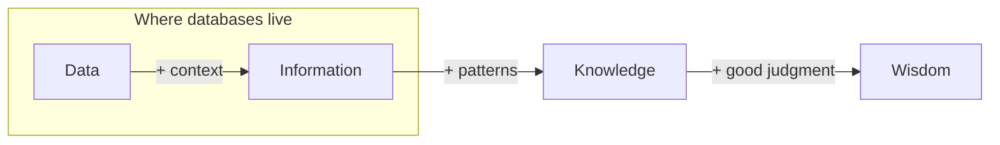

## Database versus DBMS

You never touch the stored files directly. You go through a **database management system (DBMS)** - the software that handles storage, lets many users read and write at once, enforces rules, and answers queries.

The distinction is simple: **the database is the data; the DBMS is the engine that manages it.** PostgreSQL, MongoDB, and Redis are DBMSs.

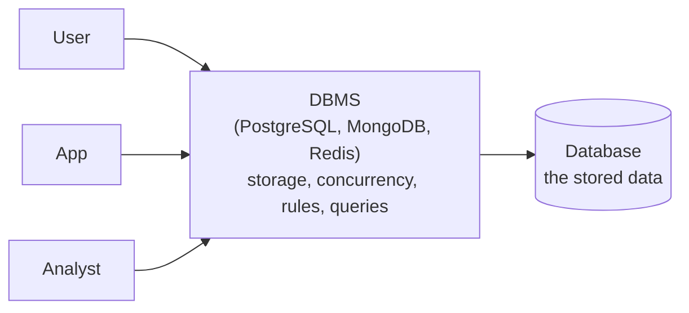

A spreadsheet stores data too, and a collaborative one like Google Sheets even lets several people edit at once. A database is what you reach for when that model breaks down: millions of rows instead of thousands, enforced structure and types so bad data cannot creep in, links between many related tables, and correctness guarantees when thousands of writes land at the same instant.

## How to choose a type

Two questions point you to the right type. Answer them in order.

**Question 1 - what shape is your data, and how will you read it?** This picks the model.

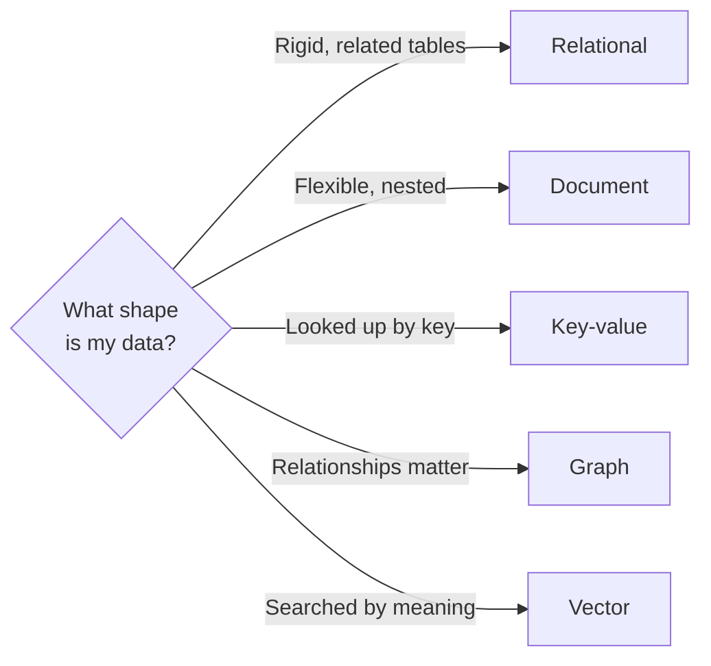

**Question 2 - what is the workload?** Two patterns need different engines, even within one model:

- **Transactional (OLTP, Online Transaction Processing)** - many small, fast reads and writes, like placing an order or updating a profile. The everyday running of an app.
- **Analytical (OLAP, Online Analytical Processing)** - a few huge questions over lots of history, like "average spend per region last quarter."

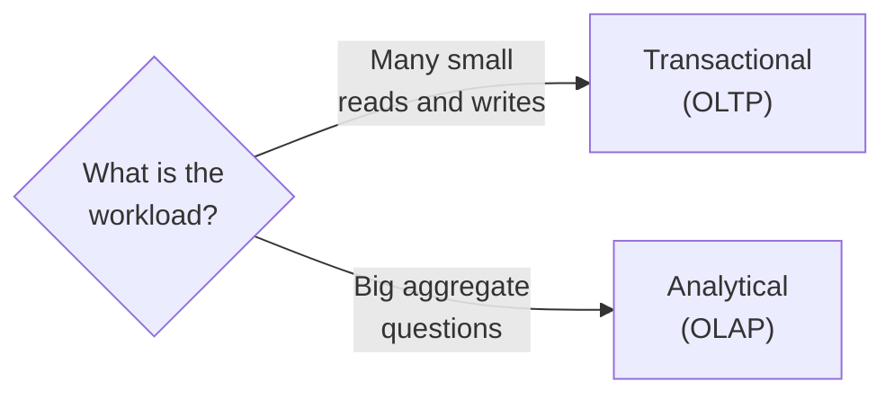

:::tip One engine often does several jobs
The lines between types blur in practice. PostgreSQL stores normal tables but also handles JSON documents, full-text search, and vector search through extensions - so you can start with one database and add capabilities as you need them.
:::

## Relational databases - the default

Reach for a relational database first. It stores data in **tables** - picture each one as a sheet in a spreadsheet:

- a **table** holds one kind of thing (all your customers, or all your orders);
- a **row** is one record - a single customer;
- a **column** is a field every row shares, with a fixed type, such as `name` (text) or `total` (a number).

You define this structure - the **schema** - up front, and the database enforces it: a column typed as a number rejects the word "blue." Tables connect to each other through **keys**, and you ask questions with **SQL**.

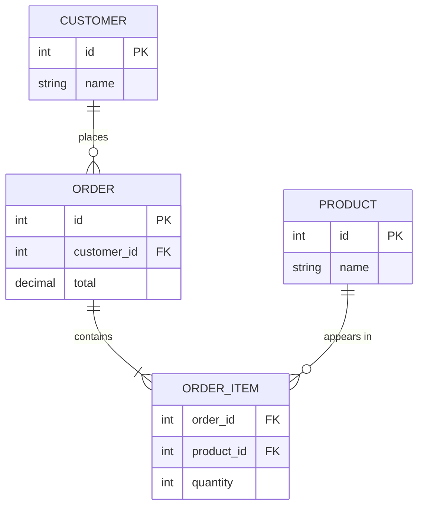

That diagram is the store's schema, and its labels are worth reading:

- **Keys.** A **primary key (PK)** uniquely identifies each row - the `id` in every table. A **foreign key (FK)** stores another table's primary key to create a link: an order's `customer_id` holds the `id` of the customer who placed it.
- **Relationships.** The lines show how rows relate, and the forked "crow's foot" end means "many." Read them as: one customer places many orders, each order contains many order items, and each order item refers to exactly one product.

This is the relational model's superpower: store each fact once, then connect tables by keys instead of copying data around. Designing tables so every fact lives in exactly one place is called **normalization** - the subject of [Stage 2](../02-designing/index.mdx).

A **query** is simply a question you ask the database. You describe the result you want and let the database work out how to fetch it. To get each customer's total spend:

```sql
SELECT name, SUM(total)
FROM customers
JOIN orders ON orders.customer_id = customers.id
GROUP BY customers.id;
```

You start writing queries like this in [Stage 1](../01-speaking-sql/index.mdx).

### ACID: why relational databases are trusted with money

The relational model's other strength is **ACID** safety. A **transaction** is a group of changes the database treats as a single unit. Take transferring 100 from account A to account B - really two steps: subtract 100 from A, add 100 to B. ACID is the promise that this never goes wrong.

- **Atomic - all or nothing.** Both steps happen, or neither does. If the database crashes after subtracting from A but before adding to B, the whole transfer is undone. Money never vanishes halfway.
- **Consistent - rules always hold.** Every transaction moves the data from one valid state to another. Constraints you defined (a balance cannot go negative, a foreign key must point to a real row) are true before and after - never in between.
- **Isolated - concurrent work does not collide.** Run a thousand transfers at once and the result is as if they ran one after another; one transfer never sees another's half-finished state. The database enforces this with **locks** (briefly reserving the rows a transaction touches so others wait their turn) or **MVCC** (giving each transaction its own consistent snapshot of the data). How strict this is can be tuned through **isolation levels** - a trade-off between safety and speed that Stage 3 covers.
- **Durable - saved stays saved.** Once the database confirms "done," the change survives a power cut or crash, because it was written to permanent storage.

That guarantee is exactly what you want for money, orders, and inventory, where a half-finished operation is worse than none at all. It is the main reason relational databases remain the default for anything that must be correct.

### Indexes: how queries stay fast

This idea shows up in every database, so meet it now: the **index**. Without one, finding a row means scanning every row - fine for hundreds, painfully slow for millions. An index is a sorted lookup structure, like the index at the back of a book: instead of reading every page, you jump straight to the right one.

The trade-off is that each index takes extra space and slightly slows writes (every insert must update the index too), so you index the columns you actually search and join on - not all of them. [Stage 3](../03-correct-and-fast/index.mdx) goes deep on indexes and query speed.

**Use it when** data has clear structure, records relate to each other, and correctness matters most. Common engines: **PostgreSQL**, **MySQL**, **SQL Server**, **Oracle**.

## NoSQL - four families, not one thing

NoSQL is a label for several models that drop some relational rules to gain flexibility, scale, or speed. Four are worth knowing.

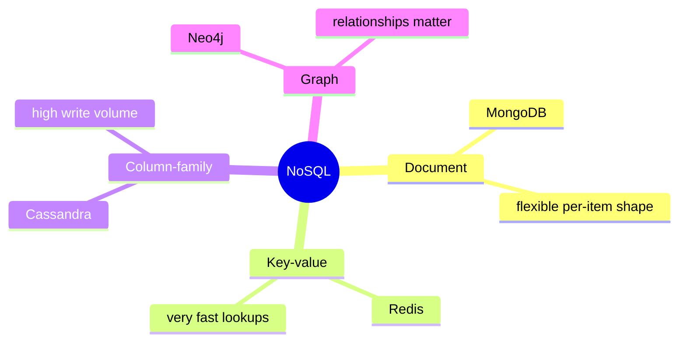

- **Document** (MongoDB) - JSON-like records that can each have a different shape. Good for varied content.
- **Key-value** (Redis) - a key points to a value; lookups are extremely fast. Good for caches, sessions, carts.
- **Column-family** (Cassandra) - built for huge write volume across many machines. Good for event logs at scale.
- **Graph** (Neo4j) - stores nodes and the relationships between them. Shines when the relationships *are* the question, like "people who bought this also bought."

Seeing each one makes the differences concrete. A **document** looks like JSON, and every record can carry its own fields - no schema migration when they differ:

```json
{
  "product_id": "A-119",
  "name": "Running shoe",
  "sizes": [40, 41, 42],
  "details": { "waterproof": true, "color": "blue" }
}
```

A **key-value** pair is exactly that - one key, one value, read in a single fast hop:

```
cart:user_8842  =>  ["A-119", "B-204", "C-008"]
```

A **graph** stores entities and the links between them. Because many buyers of one product also bought others, "also bought" falls straight out of the connections:

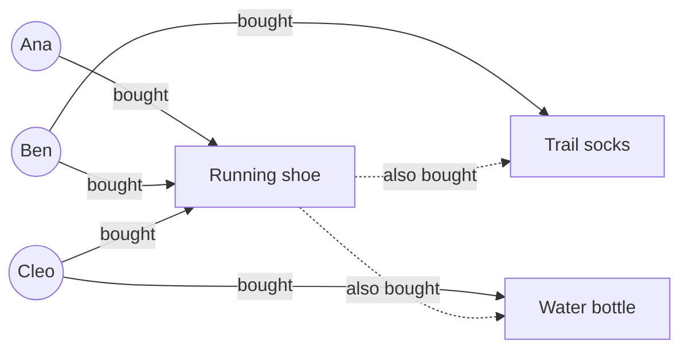

**Use NoSQL when** data does not fit neat tables, you must scale writes across many servers, or early flexibility beats strict structure.

## Vector databases - search by meaning

A **vector database** stores **embeddings**: lists of numbers that capture the *meaning* of text, images, or audio. It finds items that are **similar in meaning** rather than exact matches. Searching "comfortable shoes for long walks" can return "cushioned trainers for marathon training" - no shared keywords, close meaning.

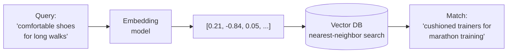

This powers semantic search, similarity recommendations, and **retrieval-augmented generation (RAG)** - where an AI assistant looks up relevant documents before answering. [Stage 6](../06-scaling/index.mdx) returns to embeddings and RAG in depth.

:::tip Often a data type, not a separate database
Vectors are increasingly just a **data type** a normal database can hold. If you already run PostgreSQL, the `pgvector` extension keeps embeddings next to your relational data. Reach for a dedicated vector database (Pinecone, Weaviate, Qdrant) when scale truly demands it.
:::

### Quick check

<Quiz
  title="Did the types land?"
  questions={[
    {
      prompt: "A product catalog where each product has a different set of attributes. Best fit?",
      options: [
        {text: "Document database", correct: true},
        {text: "Relational database"},
        {text: "Key-value database"},
        {text: "Graph database"},
      ],
      explanation: "Document stores let each record have its own shape, so varied attributes need no schema migration. A relational schema would force every product into the same columns.",
    },
    {
      prompt: "\"Customers who bought this also bought...\" recommendations. Best fit?",
      options: [
        {text: "Graph database", correct: true},
        {text: "Key-value database"},
        {text: "Vector database"},
        {text: "Column-family database"},
      ],
      explanation: "The query is about relationships between purchases, which is exactly what a graph models. Key-value only does single-key lookups; vector matches by meaning, not purchase links.",
    },
  ]}
/>

## Scaling and workload, two things to know

Two points often trip people up.

**Relational databases scale out, not just up.** Vertical scaling means a bigger single server; horizontal means more machines. **NewSQL** (distributed SQL) gives you SQL and ACID *and* horizontal scale. Examples: **CockroachDB**, **TiDB**, **Google Spanner**. Spreading data across machines forces trade-offs that [Stage 6](../06-scaling/index.mdx) digs into.

:::note Two meanings of "consistency"
Watch out for one word used two ways. ACID's **C** means a transaction leaves the data in a valid state. In distributed systems, **consistency** means every server returns the same latest value - the property the **CAP theorem** says you trade off against availability when data is spread across machines. Same word, different idea; [Stage 6](../06-scaling/index.mdx) covers the distributed kind.
:::

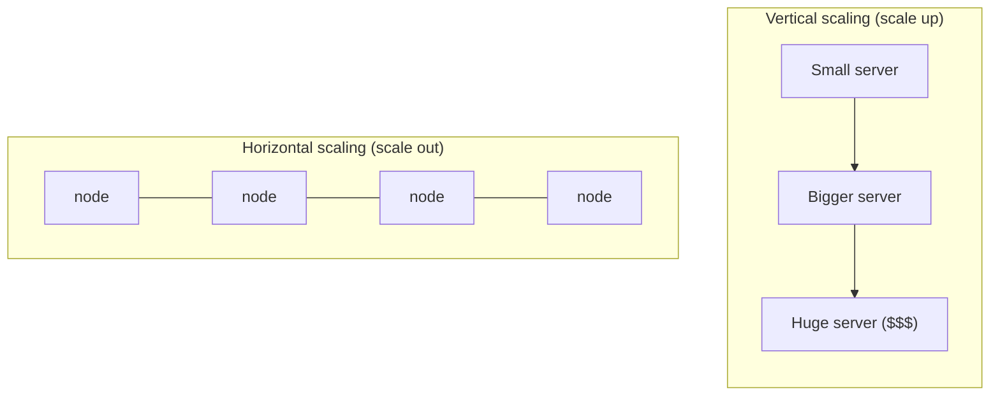

**Run analytics on a system built for analytics.** You met OLTP and OLAP above; here is the detail that matters. OLTP engines store data by **row** and stay fast for small reads and writes (PostgreSQL, MySQL). OLAP warehouses store data by **column**, so sweeping aggregations fly (Snowflake, BigQuery, ClickHouse, DuckDB). Running big analytical queries on your live OLTP database is slow and competes with real traffic, so data is copied across to a warehouse first.

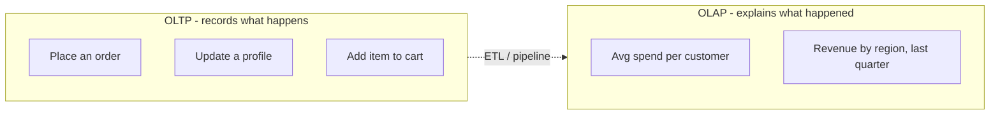

Remember it as: **OLTP records what happens; OLAP explains what happened.**

<details>
<summary>A few more categories you only need to recognize</summary>

- **Time-series** (InfluxDB, TimescaleDB) - data stamped with time, like sensor readings or metrics.
- **Search engines** (Elasticsearch, OpenSearch) - fast full-text search and ranking over large text.
- **Managed and serverless** (Neon, Supabase, PlanetScale, Aurora, Turso) - databases someone else operates, scaling to zero when idle. This is why "relational is expensive" no longer holds.

</details>

## Quick reference

A few claims you will hear, and what is actually true.

| Common claim | What is actually true |
|---|---|
| Relational scales up, NoSQL scales out | NewSQL scales relational out too |
| Relational is ACID, NoSQL is not | MongoDB and DynamoDB support transactions; consistency is often a setting |
| NoSQL has no joins | Many document and graph systems support join-like operations |
| Relational is expensive | Open-source and serverless options are cheap or free |
| Vectors need a special database | Often just an extension on your existing database |

## Real systems mix databases

One online store often uses several at once - the right tool per job. This is **polyglot persistence**.

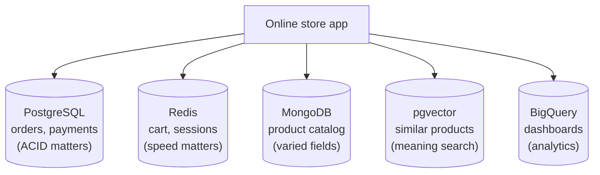

The skill is not memorizing which database is "best." It is matching the data shape and the workload to the engine that fits.

## Key takeaways

- **Data** is raw facts; **information** is data with context that supports a decision.
- A **database** stores data; a **DBMS** manages it.
- Skip "relational vs NoSQL." Ask about **data shape** and **transactional vs analytical** instead.
- **Relational** is still the sensible default when correctness and relationships matter.
- The big modern addition is the **vector database**, often just an extension.
- Real systems mix several databases - **polyglot persistence**.

## Quiz: test yourself

<Quiz
  title="Introduction to Databases - final quiz"
  questions={[
    {
      prompt: "What is the difference between a database and a DBMS?",
      options: [
        {text: "The database is the stored data; the DBMS is the software that manages it", correct: true},
        {text: "They are two words for the same thing"},
        {text: "The DBMS is the data; the database is the server"},
        {text: "A DBMS is only for relational databases"},
      ],
      explanation: "The database is the data itself; the DBMS (PostgreSQL, MongoDB, Redis) is the engine that stores, protects, and queries it. DBMSs exist for every model, not just relational.",
    },
    {
      prompt: "A banking app must record every payment so no transaction is ever lost or half-applied. Which property do you most need?",
      options: [
        {text: "ACID transactions (relational)", correct: true},
        {text: "Schema flexibility (document)"},
        {text: "Fast key lookups (key-value)"},
        {text: "Similarity search (vector)"},
      ],
      explanation: "Money needs all-or-nothing, durable writes - that is ACID, the core strength of relational databases. Flexibility and raw lookup speed do not guarantee correctness.",
    },
    {
      prompt: "Which task is the natural job of a vector database?",
      options: [
        {text: "Letting a chatbot answer from your help articles by meaning (RAG)", correct: true},
        {text: "Guaranteeing a bank transfer is atomic"},
        {text: "Storing a user session for fast retrieval by key"},
        {text: "Enforcing a fixed table schema"},
      ],
      explanation: "Vector databases match by meaning via embeddings, the basis of semantic search and RAG. Atomic transfers, key lookups, and schema enforcement are other engines' jobs.",
    },
    {
      prompt: "\"If you need to scale across many servers, you cannot use SQL.\" What is wrong with this in 2026?",
      options: [
        {text: "NewSQL databases (CockroachDB, TiDB, Spanner) scale SQL horizontally", correct: true},
        {text: "Nothing - it is still true"},
        {text: "SQL was never able to handle transactions"},
        {text: "Only key-value stores can scale at all"},
      ],
      explanation: "NewSQL / distributed SQL gives SQL and ACID while scaling out across machines, so the old trade-off is gone. SQL has always handled transactions; that is its strength.",
    },
    {
      prompt: "You need a dashboard of total revenue by country over the last three years. Which fits best?",
      options: [
        {text: "An OLAP warehouse (Snowflake, BigQuery)", correct: true},
        {text: "Your live OLTP order database"},
        {text: "A key-value cache"},
        {text: "A graph database"},
      ],
      explanation: "Few huge aggregate questions over lots of history is OLAP. Running it on the live OLTP database is slow and competes with real orders; caches and graphs do not aggregate history.",
    },
  ]}
/>

:::tip Next up
Ready to write SQL? **[Stage 1 - Speaking SQL](../01-speaking-sql/index.mdx)** takes you hands-on with the relational model.
:::
