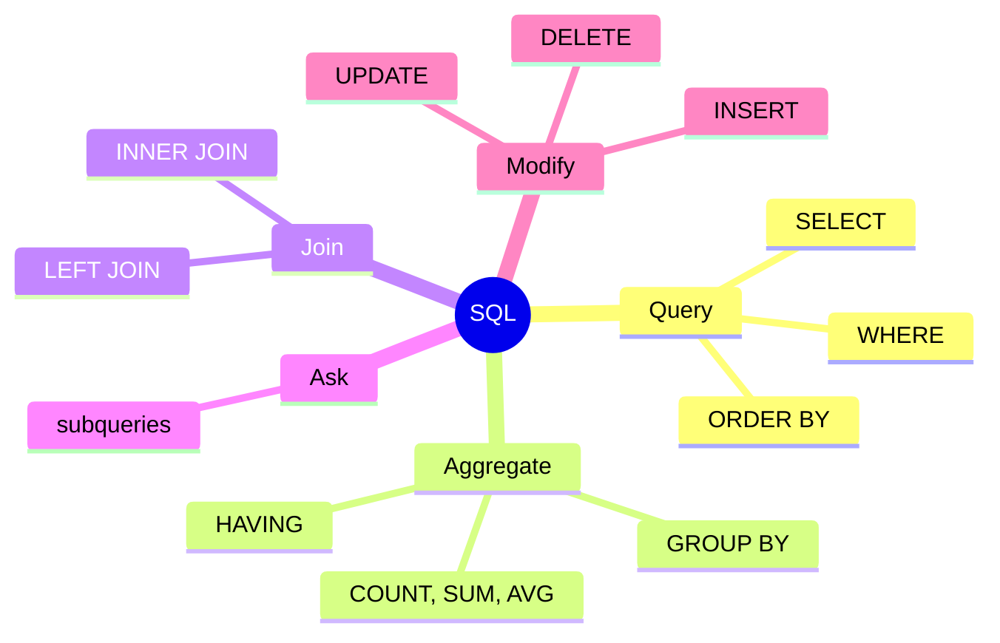
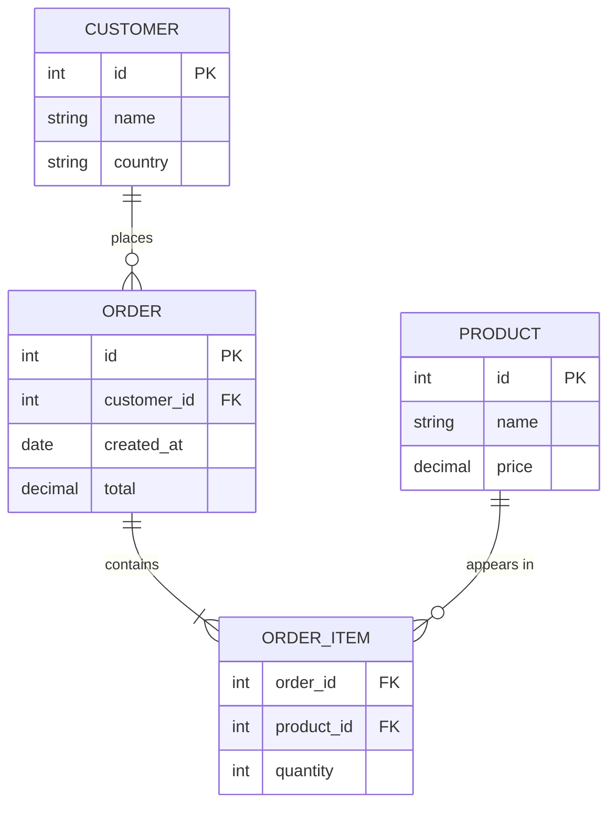

import SqlRunner from '@site/src/components/SqlRunner';

# Stage 1 - Speaking SQL

Stage 0 gave you the map. Now you start driving. The fastest way to understand a relational database is to query one, so this stage is hands-on from the first page. You will write real SQL against a small online-store database and, more importantly, start thinking the way SQL wants you to think.

:::info Learning objectives
By the end of this stage you can:

- **Query one table** - pull, filter (`WHERE`, `NULL`), sort, and limit rows with `SELECT`.
- **Summarize rows** - collapse them into totals with `COUNT`/`SUM`/`AVG`, `GROUP BY`, and `HAVING`.
- **Combine tables** - choose the right join (`INNER` vs `LEFT`) and know why the answer changes.
- **Ask layered questions** - nest queries with subqueries, `IN`, and `EXISTS`.
- **Compose larger queries** - keep them readable with CTEs (`WITH`) and set operations, and compute across rows with window functions.
- **Change data safely** - `INSERT`, `UPDATE`, and `DELETE` with a previewed `WHERE`.

That set of skills is the line between a beginner and a working practitioner.
:::

## The shape of SQL

Almost everything you do in SQL is one of five moves. Keep this picture in mind as you go; each lesson in this stage fills in one branch.

## A small relational database

A relational database stores data in **tables**. Each table is a grid: a **row** is one record, a **column** is one field. Tables are linked by **keys** - a **primary key** uniquely identifies a row, and a **foreign key** in one table points at the primary key of another.

We will use a four-table store throughout this stage. Read the diagram as "a customer places many orders, an order contains many items, and each item refers to one product."

For the worked examples, picture these few rows in the `customers` and `orders` tables. Small, concrete data is the point - you can check every query's answer by hand.

| customers | | | | orders | | | |
|---|---|---|---|---|---|---|---|
| **id** | **name** | **country** | | **id** | **customer_id** | **created_at** | **total** |
| 1 | Ana | IE | | 101 | 1 | 2026-01-05 | 40.00 |
| 2 | Ben | IE | | 102 | 1 | 2026-02-11 | 25.00 |
| 3 | Cleo | LT | | 103 | 2 | 2026-02-20 | 90.00 |
| 4 | Dee | LT | | 104 | 4 | 2026-03-02 | 25.00 |
| 5 | Eve | _(none)_ | | 105 | 6 | 2026-03-20 | 90.00 |
| 6 | Finn | IE | | | | | |

Ana (customer 1) has two orders; Ben (customer 2) has one; Cleo (3) and Eve (5) have none yet. Eve has no country recorded - a `NULL`. Hold onto these quirks: the customers with no orders, and the missing country, are exactly what make joins and `NULL` handling interesting later.

This database is live - it runs in your browser. Press **Run** to see the rows, and change the query to explore:

<SqlRunner query={`SELECT * FROM orders;`} />

## Think in sets, not loops

This is the one idea that separates people who fight SQL from people who enjoy it.

If you come from ordinary programming, your instinct is to loop: "go through each order, check its date, add up the totals." SQL does not work that way, and trying to make it is the most common beginner mistake.

SQL is **declarative**. You describe the set of rows you want and the result you want computed from them; the database decides how to fetch and combine them. You never write the loop. "Sum the totals of every 2026 order, grouped by customer" is a single statement, not an iteration:

<SqlRunner
  query={`SELECT customer_id, SUM(total)
FROM orders
WHERE created_at >= '2026-01-01'
GROUP BY customer_id;`}
  height={120}
/>

You stated *what* set you wanted (2026 orders), *how* to group it (by customer), and *what* to compute (the sum). No counter, no loop, no temporary list. Every lesson below is really just a richer way of describing a set of rows.

## The lessons in this stage

1. **[Querying](./querying.mdx)** - pull rows out of one table with `SELECT`, `WHERE`, `ORDER BY`, and `LIMIT`, and learn the order the database actually evaluates them in.
2. **[Aggregating](./aggregating.mdx)** - collapse many rows into summaries with `COUNT`, `SUM`, `AVG`, `GROUP BY`, and `HAVING`.
3. **[Joining tables](./joins.mdx)** - combine rows across tables, and learn why `INNER` and `LEFT` joins give different answers.
4. **[Subqueries and writes](./subqueries-and-writes.mdx)** - nest queries with subqueries and `EXISTS`, then insert, update, and delete rows safely.
5. **[CTEs and set operations](./composing-queries.mdx)** - keep longer queries readable with CTEs (`WITH`) and combine results with set operations.
6. **[Window functions](./window-functions.mdx)** - running totals, ranks, and row-to-row comparisons across a window, without collapsing rows.
7. **[Data types and dates](./data-types-and-dates.mdx)** - the core types, casting, and date/time handling (including the time-zone trap).
8. **[Changing data - DML and TCL](./dml-and-tcl.mdx)** - group the write statements into families and control them with transactions, in a live in-browser SQL sandbox you can run yourself.
9. **[Stage 1 review](./assessment.mdx)** - a cumulative final: mixed live challenges and a quiz spanning everything above, to prove the whole stage stuck.

Each lesson ends with a short exercise that moves from a worked example to one you finish to one you write from scratch. Do them - reading SQL and writing SQL are different skills. The stage closes with a [cumulative review](./assessment.mdx) that pulls from every lesson at once.

:::tip Run SQL right here
Throughout this stage the query boxes are **live**: a real SQLite database runs in your browser, so you can edit and execute every example against the store - no install, nothing to break (a **Reset data** button restores the rows).
:::
