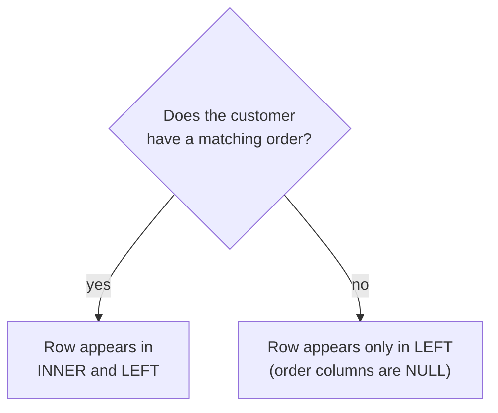

import SqlRunner from '@site/src/components/SqlRunner';
import Quiz from '@site/src/components/Quiz';

# Joining tables

Real questions span more than one table. "Show each order with the customer's name" needs `orders` and `customers` together. A **join** matches rows from two tables on a condition - almost always a foreign key meeting the primary key it points at.

<SqlRunner query={`SELECT orders.id, customers.name, orders.total
FROM orders
JOIN customers ON orders.customer_id = customers.id;`} />

For every order, the database finds the customer whose `id` equals that order's `customer_id`, and stitches the two rows into one. This is the relational model paying off: you store customers once, orders once, and combine them on demand instead of repeating the customer's name on every order.

## INNER versus LEFT: which rows survive

There are several join types, but you will spend almost all your time choosing between two, and the choice changes the answer.

An **INNER JOIN** (the default when you write just `JOIN`) keeps only rows that have a match on **both** sides. A **LEFT JOIN** keeps **every** row from the left table, and fills the right-side columns with `NULL` where there is no match.



The difference is not academic. Recall from the [stage overview](./) that Cleo has no orders. Ask "list every customer and their order total":

- **INNER JOIN** drops Cleo entirely - she has no matching order, so she vanishes from the report.
- **LEFT JOIN** keeps Cleo, with `NULL` (or `0` if you wrap it in `COALESCE`) for her total.

Run this `LEFT JOIN` - Cleo appears with `NULL`. Then change `LEFT JOIN` to plain `JOIN` and run again: Cleo vanishes. That single word is the whole lesson.

<SqlRunner query={`SELECT customers.name, orders.total
FROM customers
LEFT JOIN orders ON orders.customer_id = customers.id;`} />

The trap: people reach for `JOIN` out of habit and silently lose the rows with no match. If your "customers and their orders" report is missing customers, an inner join is usually why. Ask yourself which table you want *every* row from, and put it on the left with a `LEFT JOIN`.

## The other join types

You will reach for `INNER` and `LEFT` almost every time. Three more exist; recognise them and know when they help.

| Join | Keeps |
|---|---|
| `INNER JOIN` | only rows matched on both sides |
| `LEFT JOIN` | every left row + matches (right is `NULL` when none) |
| `RIGHT JOIN` | every right row + matches (mirror of `LEFT`) |
| `FULL OUTER JOIN` | every row from **both** sides, matched where possible |
| `CROSS JOIN` | every left row paired with every right row |

**`RIGHT JOIN`** is just a `LEFT JOIN` with the tables swapped, so most people stick to `LEFT` for consistency. **`FULL OUTER JOIN`** keeps unmatched rows from *both* tables at once - useful for reconciliation ("which records exist on one side but not the other?").

:::note Dialect note
`RIGHT JOIN` and `FULL OUTER JOIN` are long-standing in PostgreSQL, SQL Server, and MySQL, but **SQLite only added them in 3.39** (2022). This sandbox is newer, so they run here - just know older SQLite builds reject them.
:::

**`CROSS JOIN`** has no `ON` condition. It produces the **Cartesian product** - every combination of left and right rows. Six customers and four products give twenty-four pairs (6 × 4):

<SqlRunner query={`SELECT customers.name, products.name AS product
FROM customers
CROSS JOIN products;`} height={130} />

Useful for generating combinations (every size of every shirt), but easy to trigger by accident - a missing `ON` turns a normal join into a row explosion.

## Joins and aggregates together

Joins and the previous lesson's grouping combine naturally - join first, then group the joined rows:

<SqlRunner
  query={`SELECT customers.name, COUNT(orders.id) AS order_count
FROM customers
LEFT JOIN orders ON orders.customer_id = customers.id
GROUP BY customers.id;`}
  height={140}
/>

Because it is a `LEFT JOIN`, Cleo appears with a count of `0`. With an inner join she would be missing - a subtle but common reporting bug.

Note the `GROUP BY customers.id`, not `customers.name`. Group by the **key**, not a label that might collide: two different customers named "Ana" would silently merge into one row if you grouped by name. The id is unique, so each customer stays a distinct group - you can still `SELECT` the name to display it.

## Self-join: a table joined to itself

A **self-join** joins a table to a second copy of itself, using table aliases to tell the two apart. It is how you compare rows *within* one table - "find pairs," "match a row to a related row." Here we pair customers who share a country (and use `a.id < b.id` so each pair appears once, never paired with itself):

<SqlRunner
  query={`SELECT a.name AS customer_a, b.name AS customer_b, a.country
FROM customers a
JOIN customers b ON a.country = b.country AND a.id < b.id;`}
  height={150}
/>

The aliases `a` and `b` are essential - without them the database cannot tell which copy of `customers` you mean. The three Irish customers (Ana, Ben, Finn) yield three pairs and the two Lithuanians (Cleo, Dee) one more; Eve's country is `NULL`, so she never matches - `NULL` is never equal to `NULL`.

## Joining three tables

Joins chain: add another `JOIN` for each table you need. To go from an order to the product names on it, hop `orders` → `order_items` → `products`:

<SqlRunner
  query={`SELECT orders.id AS order_id, products.name AS product, order_items.quantity
FROM orders
JOIN order_items ON order_items.order_id = orders.id
JOIN products    ON products.id = order_items.product_id
ORDER BY orders.id;`}
  height={170}
/>

Each `JOIN` matches a foreign key to the primary key it points at. `order_items` is a **join table** - it links orders to products and carries the per-line `quantity`. Read the chain top to bottom: every order, its line items, and the product each line refers to.

## Exercise

Use the sandbox.

<SqlRunner query={`SELECT orders.id, customers.name
FROM orders
JOIN customers ON orders.customer_id = customers.id;`} />

**1. Worked.** Show each order's id alongside the buyer's name (the query above).

**2. Finish it.** List *every* customer and how many orders they have, including those with none. Fill the blanks, then run - the box checks your result.

<SqlRunner
  query={`SELECT customers.name, COUNT(orders.id) AS orders
FROM customers
____ JOIN orders ON orders.customer_id = customers.id
GROUP BY ____;`}
  solution={`SELECT customers.name, COUNT(orders.id) AS orders FROM customers LEFT JOIN orders ON orders.customer_id = customers.id GROUP BY customers.id;`}
/>

**3. Write it yourself.** Show only customers who have placed at least one order, with their total spend - highest spend first, then by name to break ties. Run it to check your answer.

<SqlRunner
  query={`-- Write your query here, then press Run\n`}
  solution={`SELECT customers.name, SUM(orders.total) AS spent FROM customers JOIN orders ON orders.customer_id = customers.id GROUP BY customers.id ORDER BY spent DESC, customers.name;`}
  ordered
/>

<details>
<summary>Show answers</summary>

**2.** `LEFT JOIN orders ON orders.customer_id = customers.id GROUP BY customers.id;`

**3.**

```sql
SELECT customers.name, SUM(orders.total) AS spent
FROM customers
JOIN orders ON orders.customer_id = customers.id
GROUP BY customers.id
ORDER BY spent DESC, customers.name;
```

An inner `JOIN` is correct here: "customers who have placed an order" is exactly the rows with a match on both sides.

</details>

## Quick quiz

<Quiz
  title="Joining tables"
  questions={[
    {
      prompt: "Cleo and Eve have no orders. You run customers INNER JOIN orders. What happens to them?",
      options: [
        {text: "They are dropped - an INNER JOIN keeps only rows matched on both sides", correct: true},
        {text: "They appear with NULL totals", correct: false},
        {text: "They appear with a total of 0", correct: false},
        {text: "The query errors", correct: false},
      ],
      explanation: "INNER JOIN keeps only matched rows. With no matching order, Cleo and Eve vanish; a LEFT JOIN would keep them with NULLs.",
    },
    {
      prompt: "Which join keeps every customer, filling order columns with NULL where there is no match?",
      options: [
        {text: "LEFT JOIN (with customers on the left)", correct: true},
        {text: "INNER JOIN", correct: false},
        {text: "CROSS JOIN", correct: false},
        {text: "A plain JOIN", correct: false},
      ],
      explanation: "A LEFT JOIN keeps every row of the left table and pads the right side with NULL when nothing matches.",
    },
    {
      prompt: "A CROSS JOIN of the 6 customers and 4 products returns how many rows?",
      options: [
        {text: "24", correct: true},
        {text: "10", correct: false},
        {text: "6", correct: false},
        {text: "4", correct: false},
      ],
      explanation: "A CROSS JOIN is the Cartesian product: every left row paired with every right row, so 6 × 4 = 24.",
    },
    {
      prompt: "Why does the lesson GROUP BY customers.id rather than customers.name?",
      options: [
        {text: "The id is unique, so two customers sharing a name stay separate groups", correct: true},
        {text: "Grouping by text is not allowed", correct: false},
        {text: "name cannot appear in the SELECT list otherwise", correct: false},
        {text: "It makes the query run faster", correct: false},
      ],
      explanation: "Grouping by a non-unique label like name would merge two different people named 'Ana'. The primary key keeps each customer distinct.",
    },
    {
      prompt: "To list each order with the product names on it, you join orders, order_items, and products. What kind of join is this?",
      options: [
        {text: "A multi-table (three-table) join chaining one JOIN per table", correct: true},
        {text: "A self-join", correct: false},
        {text: "A CROSS JOIN", correct: false},
        {text: "A FULL OUTER JOIN", correct: false},
      ],
      explanation: "Joins chain: orders → order_items → products, each matching a foreign key to its primary key. order_items is the join table linking the two.",
    },
    {
      prompt: "What makes a self-join work?",
      options: [
        {text: "Table aliases that name two copies of the same table so you can compare rows within it", correct: true},
        {text: "A special SELF JOIN keyword", correct: false},
        {text: "Two different tables with the same columns", correct: false},
        {text: "Removing the ON condition", correct: false},
      ],
      explanation: "A self-join joins a table to itself; aliases (e.g. a and b) distinguish the two copies so the ON condition can relate one row to another.",
    },
  ]}
/>
