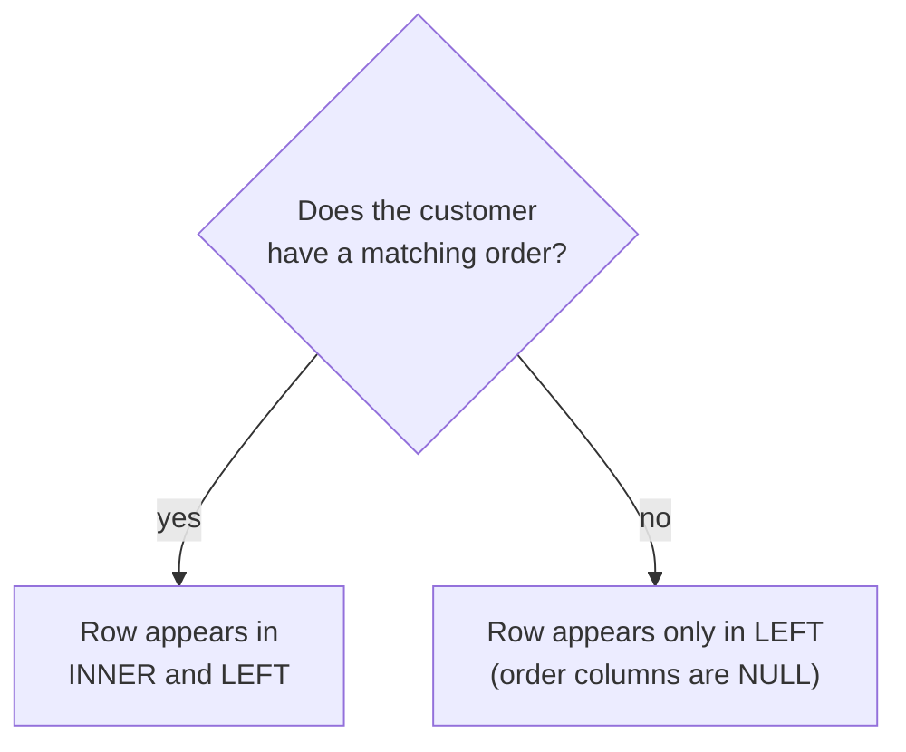

import SqlRunner from '@site/src/components/SqlRunner';

# Joining tables

Real questions span more than one table. "Show each order with the customer's name" needs `orders` and `customers` together. A **join** matches rows from two tables on a condition - almost always a foreign key meeting the primary key it points at.

<SqlRunner query={`SELECT orders.id, customers.name, orders.total
FROM orders
JOIN customers ON orders.customer_id = customers.id;`} />

For every order, the database finds the customer whose `id` equals that order's `customer_id`, and stitches the two rows into one. This is the relational model paying off: you store customers once, orders once, and combine them on demand instead of repeating the customer's name on every order.

## INNER versus LEFT: which rows survive

There are several join types, but you will spend almost all your time choosing between two, and the choice changes the answer.

An **INNER JOIN** (the default when you write just `JOIN`) keeps only rows that have a match on **both** sides. A **LEFT JOIN** keeps **every** row from the left table, and fills the right-side columns with `NULL` where there is no match.



The difference is not academic. Recall from the [stage overview](./) that Cleo has no orders. Ask "list every customer and their order total":

- **INNER JOIN** drops Cleo entirely - she has no matching order, so she vanishes from the report.
- **LEFT JOIN** keeps Cleo, with `NULL` (or `0` if you wrap it in `COALESCE`) for her total.

Run this `LEFT JOIN` - Cleo appears with `NULL`. Then change `LEFT JOIN` to plain `JOIN` and run again: Cleo vanishes. That single word is the whole lesson.

<SqlRunner query={`SELECT customers.name, orders.total
FROM customers
LEFT JOIN orders ON orders.customer_id = customers.id;`} />

The trap: people reach for `JOIN` out of habit and silently lose the rows with no match. If your "customers and their orders" report is missing customers, an inner join is usually why. Ask yourself which table you want *every* row from, and put it on the left with a `LEFT JOIN`.

## The other join types

You will reach for `INNER` and `LEFT` almost every time. Three more exist; recognise them and know when they help.

| Join | Keeps |
|---|---|
| `INNER JOIN` | only rows matched on both sides |
| `LEFT JOIN` | every left row + matches (right is `NULL` when none) |
| `RIGHT JOIN` | every right row + matches (mirror of `LEFT`) |
| `FULL OUTER JOIN` | every row from **both** sides, matched where possible |
| `CROSS JOIN` | every left row paired with every right row |

**`RIGHT JOIN`** is just a `LEFT JOIN` with the tables swapped, so most people stick to `LEFT` for consistency. **`FULL OUTER JOIN`** keeps unmatched rows from *both* tables at once - useful for reconciliation ("which records exist on one side but not the other?").

**`CROSS JOIN`** has no `ON` condition. It produces the **Cartesian product** - every combination of left and right rows. Three customers and three products give nine pairs:

<SqlRunner query={`SELECT customers.name, products.name AS product
FROM customers
CROSS JOIN products;`} height={130} />

Useful for generating combinations (every size of every shirt), but easy to trigger by accident - a missing `ON` turns a normal join into a row explosion.

## Joins and aggregates together

Joins and the previous lesson's grouping combine naturally - join first, then group the joined rows:

<SqlRunner
  query={`SELECT customers.name, COUNT(orders.id) AS order_count
FROM customers
LEFT JOIN orders ON orders.customer_id = customers.id
GROUP BY customers.id;`}
  height={140}
/>

Because it is a `LEFT JOIN`, Cleo appears with a count of `0`. With an inner join she would be missing - a subtle but common reporting bug.

Note the `GROUP BY customers.id`, not `customers.name`. Group by the **key**, not a label that might collide: two different customers named "Ana" would silently merge into one row if you grouped by name. The id is unique, so each customer stays a distinct group - you can still `SELECT` the name to display it.

## Exercise

Use the sandbox.

<SqlRunner query={`SELECT orders.id, customers.name
FROM orders
JOIN customers ON orders.customer_id = customers.id;`} />

**1. Worked.** Show each order's id alongside the buyer's name (the query above).

**2. Finish it.** List *every* customer and how many orders they have, including those with none. Fill the blanks, then run - the box checks your result.

<SqlRunner
  query={`SELECT customers.name, COUNT(orders.id) AS orders
FROM customers
____ JOIN orders ON orders.customer_id = customers.id
GROUP BY ____;`}
  solution={`SELECT customers.name, COUNT(orders.id) AS orders FROM customers LEFT JOIN orders ON orders.customer_id = customers.id GROUP BY customers.id;`}
/>

**3. Write it yourself.** Show only customers who have placed at least one order, with their total spend - highest spend first, then by name to break ties. Run it to check your answer.

<SqlRunner
  query={`-- Write your query here, then press Run\n`}
  solution={`SELECT customers.name, SUM(orders.total) AS spent FROM customers JOIN orders ON orders.customer_id = customers.id GROUP BY customers.id ORDER BY spent DESC, customers.name;`}
  ordered
/>

<details>
<summary>Show answers</summary>

**2.** `LEFT JOIN orders ON orders.customer_id = customers.id GROUP BY customers.id;`

**3.**

```sql
SELECT customers.name, SUM(orders.total) AS spent
FROM customers
JOIN orders ON orders.customer_id = customers.id
GROUP BY customers.id
ORDER BY spent DESC, customers.name;
```

An inner `JOIN` is correct here: "customers who have placed an order" is exactly the rows with a match on both sides.

</details>
