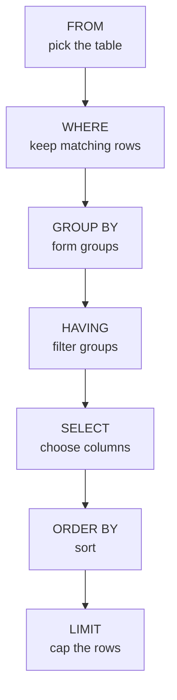

import SqlRunner from '@site/src/components/SqlRunner';
import Quiz from '@site/src/components/Quiz';

# Querying data

`SELECT` is the statement you will write more than any other. It **reads** rows from one or more tables without changing them, and it belongs to **DML** (Data Manipulation Language), one of [SQL's sublanguages](./dml-and-tcl.mdx). This lesson covers reading from a single table; [joins](./joins.mdx) add more tables later.

Every query box below is live - edit it and press **Run** (or **Ctrl+Enter**).

## The anatomy of a query

A `SELECT` reads like a sentence: *select these columns, from this table, where this is true, sorted this way, and stop after so many rows.*

<SqlRunner query={`SELECT name, country
FROM customers
WHERE country = 'IE'
ORDER BY name
LIMIT 10;`} />

Five clauses do the work, and you almost always write them in this order:

- **`SELECT`** - which columns (or computed values) to return.
- **`FROM`** - which table to read.
- **`WHERE`** - which rows to keep.
- **`ORDER BY`** - how to sort the result.
- **`LIMIT`** - how many rows to return.

Only `SELECT` and `FROM` are required. The rest are optional filters and shaping on top.

## Choosing what comes back

The column list after `SELECT` is not limited to stored columns. You can compute values and rename them with **`AS`** (an *alias*):

<SqlRunner query={`SELECT name,
       total,
       total * 1.23 AS total_with_vat
FROM orders
JOIN customers ON customers.id = orders.customer_id;`} height={140} />

`SELECT *` returns every column. It is handy when exploring, but in real queries prefer naming the columns you need - it is clearer and avoids hauling back data you will not use.

Use **`DISTINCT`** to collapse duplicate rows. "Which countries do we have customers in?" should list each country once:

<SqlRunner query={`SELECT DISTINCT country
FROM customers;`} />

## Filtering rows with WHERE

`WHERE` keeps only the rows whose condition is true. The basic operators are comparisons - `=`, `<>` (not equal), `<`, `>`, `<=`, `>=` - combined with **`AND`**, **`OR`**, and **`NOT`**.

Beyond those, four constructs do most of the day-to-day filtering.

### Ranges, lists, and patterns

- **`BETWEEN a AND b`** - an inclusive range. `WHERE total BETWEEN 20 AND 50`.
- **`IN (...)`** - matches any value in a list; **`NOT IN`** excludes them. Clearer than a chain of `OR`s.
- **`LIKE`** - matches a text pattern, where `%` is "any run of characters" and `_` is "exactly one." `WHERE name LIKE 'A%'` finds names starting with A.

<SqlRunner query={`SELECT *
FROM orders
WHERE total BETWEEN 20 AND 50
  AND customer_id IN (1, 2);`} height={130} />

### Working with NULL

`NULL` means **unknown** - no value recorded. It is not zero and not an empty string, and it has a surprising rule: any comparison *with* `NULL` returns neither true nor false, but **unknown**. So `WHERE country = NULL` matches nothing, even for rows that have no country.

To test for missing values, use **`IS NULL`** and **`IS NOT NULL`**:

<SqlRunner query={`SELECT name, country
FROM customers
WHERE country IS NOT NULL;`} />

This three-valued logic (true / false / unknown) is the single most common source of "why didn't that row come back?" - when a filter behaves oddly, suspect a `NULL`.

## Conditional logic with CASE

A **`CASE` expression** computes a value per row by testing conditions in order - SQL's `if/else`. It belongs in the `SELECT` list (or `ORDER BY`), returning the result of the first `WHEN` that is true, or the `ELSE` if none match.

Bucket each order into `'big'` or `'small'` by its total:

<SqlRunner
  query={`SELECT id, total,
       CASE WHEN total >= 50 THEN 'big' ELSE 'small' END AS size
FROM orders;`}
  height={140}
/>

Chain several `WHEN`s for more than two buckets. The first match wins, so order them from most to least specific:

<SqlRunner
  query={`SELECT id, total,
       CASE
         WHEN total >= 90 THEN 'large'
         WHEN total >= 40 THEN 'medium'
         ELSE 'small'
       END AS band
FROM orders;`}
  height={170}
/>

## COALESCE and NULLIF: handling NULL in output

Two small functions tidy up `NULL` in the `SELECT` list, where `CASE` would be clumsy.

- **`COALESCE(a, b, ...)`** returns the **first non-NULL** argument. Use it to supply a default: show a country, or `'unknown'` when it is missing.
- **`NULLIF(a, b)`** returns `NULL` when `a = b`, else `a`. Use it to turn a sentinel value into a real `NULL`, or to dodge divide-by-zero.

Eve has no country. `COALESCE` substitutes a label:

<SqlRunner
  query={`SELECT name, COALESCE(country, 'unknown') AS country
FROM customers;`}
  height={170}
/>

:::tip COALESCE pairs with LEFT JOIN
A `LEFT JOIN` fills unmatched columns with `NULL`. Wrapping the total in `COALESCE(total, 0)` turns "no orders" into a clean `0` instead of a blank - you will use this in [joins](./joins.mdx).
:::

## Sorting and limiting

**`ORDER BY`** sorts the result - `ASC` (ascending, the default) or `DESC`. Give several keys to break ties: sort by country, then by name within each country. **`LIMIT`** caps the row count, and **`OFFSET`** skips rows first (useful for paging).

<SqlRunner query={`SELECT name, total
FROM orders
JOIN customers ON customers.id = orders.customer_id
ORDER BY total DESC
LIMIT 2;`} height={130} />

## The order SQL really runs in

Here is the subtlety that trips up nearly everyone. You *write* the clauses in one order, but the database *evaluates* them in another. That is why you can filter on a column in `WHERE` yet cannot use an alias defined in `SELECT` - when `WHERE` runs, the `SELECT` list has not been computed yet.



Read it top to bottom: the database starts with the whole table, drops rows that fail `WHERE`, optionally groups what survives, *then* computes the `SELECT` list, sorts, and trims. Carry this picture with you - it explains most "why didn't that work" moments, and it is the backbone of the next lesson on [aggregation](./aggregating.mdx).

## Exercise

Write your answers in the sandbox - the third one checks your result automatically.

<SqlRunner query={`SELECT name
FROM customers
WHERE country = 'IE'
ORDER BY name;`} />

**1. Worked.** Return the names of customers in Ireland, alphabetically (the query above).

**2. Finish it.** Return the `id` and `total` of every order of at least 30.00, largest first. Fill in the blanks, then run - the box checks your result.

<SqlRunner
  query={`SELECT id, total
FROM orders
WHERE total >= ____
ORDER BY total ____;`}
  solution={`SELECT id, total FROM orders WHERE total >= 30.00 ORDER BY total DESC;`}
  ordered
/>

**3. Write it yourself.** Return only the three most recent orders: their `id` and `created_at`, newest first. Run it - the box checks your result against the expected answer.

<SqlRunner
  query={`-- Write your query here, then press Run\n`}
  solution={`SELECT id, created_at FROM orders ORDER BY created_at DESC LIMIT 3;`}
  ordered
/>

**4. Finish it (CASE + COALESCE).** For each customer show their `name`, their country (or `'unknown'` when missing), and a `region` of `'home'` when the country is `'IE'` else `'away'`. Fill the blanks, then run - the box checks your result.

<SqlRunner
  query={`SELECT name,
       COALESCE(country, '____') AS country,
       CASE WHEN country = '____' THEN 'home' ELSE 'away' END AS region
FROM customers;`}
  solution={`SELECT name, COALESCE(country, 'unknown') AS country, CASE WHEN country = 'IE' THEN 'home' ELSE 'away' END AS region FROM customers;`}
/>

<details>
<summary>Show answers</summary>

**2.** `WHERE total >= 30.00 ORDER BY total DESC;`

**3.**

```sql
SELECT id, created_at
FROM orders
ORDER BY created_at DESC
LIMIT 3;
```

**4.**

```sql
SELECT name,
       COALESCE(country, 'unknown') AS country,
       CASE WHEN country = 'IE' THEN 'home' ELSE 'away' END AS region
FROM customers;
```

Eve's country is `NULL`, so `country = 'IE'` is *unknown* (not true) and her region is `'away'`.

</details>

## Quick quiz

<Quiz
  title="Querying data"
  questions={[
    {
      prompt: "Which two clauses are the only required parts of a SELECT?",
      options: [
        {text: "SELECT and FROM", correct: true},
        {text: "SELECT and WHERE", correct: false},
        {text: "FROM and ORDER BY", correct: false},
        {text: "SELECT and LIMIT", correct: false},
      ],
      explanation: "You must say what to return (SELECT) and where to read it (FROM). WHERE, ORDER BY, and LIMIT are optional filtering and shaping.",
    },
    {
      prompt: "Eve has no country recorded (NULL). Which condition matches her row?",
      options: [
        {text: "country IS NULL", correct: true},
        {text: "country = NULL", correct: false},
        {text: "country = ''", correct: false},
        {text: "country <> 'IE'", correct: false},
      ],
      explanation: "Any comparison with NULL yields 'unknown', so country = NULL matches nothing. IS NULL is the only test for a missing value.",
    },
    {
      prompt: "Why can't you reference a SELECT-list alias inside the WHERE clause?",
      options: [
        {text: "WHERE runs before SELECT, so the alias does not exist yet", correct: true},
        {text: "Aliases are only allowed in ORDER BY", correct: false},
        {text: "WHERE cannot use any column names", correct: false},
        {text: "It is allowed in every database", correct: false},
      ],
      explanation: "SQL evaluates FROM and WHERE before SELECT computes its column list, so a WHERE clause cannot see an alias defined in SELECT.",
    },
    {
      prompt: "What does COALESCE(country, 'unknown') return for a row where country is NULL?",
      options: [
        {text: "'unknown'", correct: true},
        {text: "NULL", correct: false},
        {text: "An empty string", correct: false},
        {text: "An error", correct: false},
      ],
      explanation: "COALESCE returns its first non-NULL argument. When country is NULL, it falls through to 'unknown'.",
    },
    {
      prompt: "ORDER BY total DESC LIMIT 2 on the orders table returns which rows?",
      options: [
        {text: "The two largest totals (the 90.00 orders 103 and 105)", correct: true},
        {text: "The two smallest totals", correct: false},
        {text: "The two oldest orders", correct: false},
        {text: "A random pair of rows", correct: false},
      ],
      explanation: "DESC sorts largest first; the two 90.00 orders (103 and 105) top the list, and LIMIT 2 keeps them.",
    },
  ]}
/>
