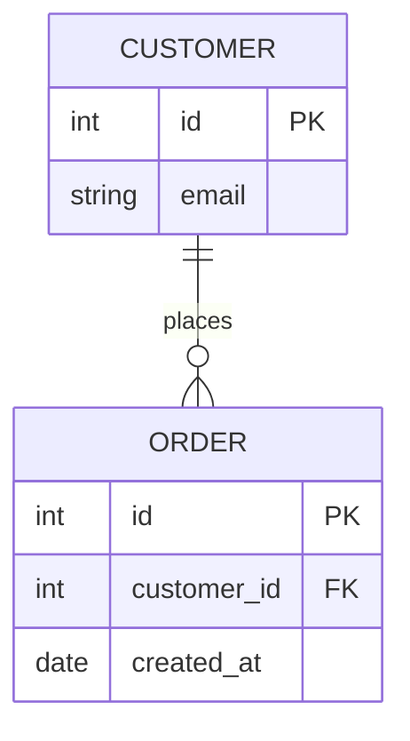
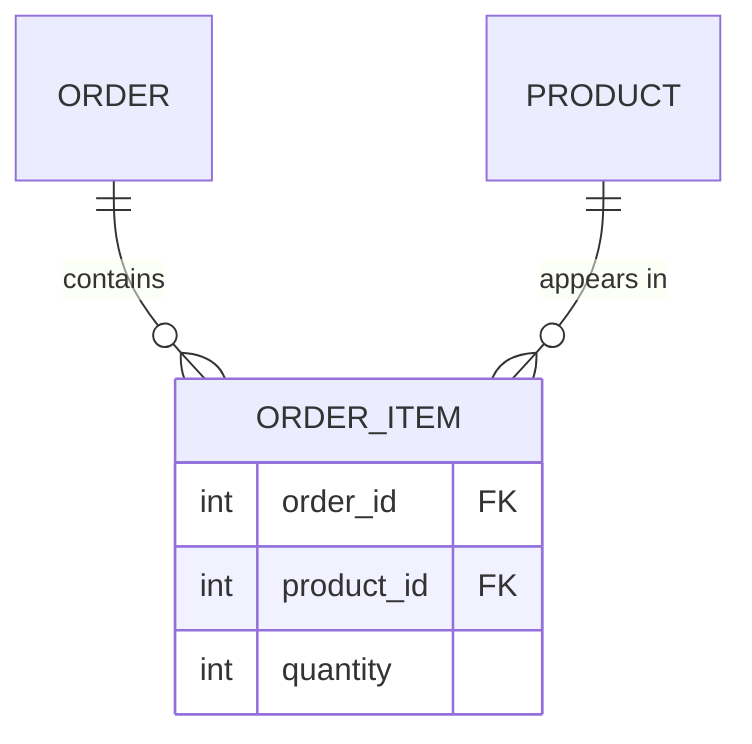
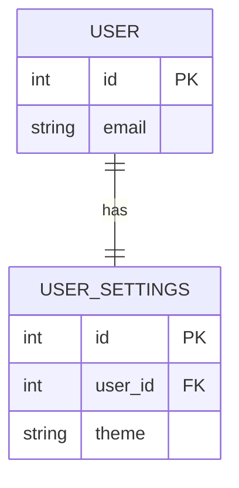

import SqlRunner from '@site/src/components/SqlRunner';
import Quiz from '@site/src/components/Quiz';

# Modeling with ER diagrams

Before you write `CREATE TABLE`, you decide *what* tables to create. **Entity-relationship (ER) modeling** is the bridge from a plain-language description of a business to a schema. The trick is grammatical: the **nouns** become tables, their **properties** become columns, and the **verbs** between them become relationships.

> "**Customers** place **orders**. Each order contains **products**."

Three nouns - customer, order, product - three tables. "Place" and "contains" are the relationships.

## Entities and attributes

An **entity** is a thing worth storing (a customer, an order). It becomes a **table**, and each real instance is a **row**. Its **attributes** - name, email, price - become **columns** with types. Every entity needs a way to identify one row from another: a **key**.

## Keys

A **primary key (PK)** uniquely identifies each row. You have two choices:

- A **natural key** is real data that happens to be unique - an email, an ISBN. The risk: real data changes (people change email) and then so must every reference.
- A **surrogate key** is a meaningless, stable id the database generates - an auto-incrementing integer, or in 2026 increasingly a **UUID** (use **UUIDv7**, which is time-ordered and indexes well). It never changes, so it is the safer default.

### Composite keys

A primary key need not be a single column. A **composite key** is a primary key made of two or more columns together. The natural home is a join table: in `order_items`, neither `order_id` nor `product_id` is unique alone, but the **pair** is - one product appears at most once per order. So `PRIMARY KEY (order_id, product_id)` is both the identity and a guard against duplicate lines, for free.

```sql
CREATE TABLE order_item (
  order_id   INTEGER REFERENCES orders(id),
  product_id INTEGER REFERENCES products(id),
  quantity   INTEGER NOT NULL,
  PRIMARY KEY (order_id, product_id)
);
```

When does this natural composite key beat adding a surrogate `id`? Prefer the composite key when the pair is genuinely the row's identity and nothing else references the row. Prefer a surrogate when another table must point *at* a line item (a single FK column is simpler than a two-column one), or when the same pair can legitimately repeat. For most pure join tables, the composite key is the cleaner choice.

A **foreign key (FK)** is a column holding another table's primary key. It is what *links* tables, and the database enforces **referential integrity**: you cannot point a FK at a row that does not exist, nor (without care) delete a row others still reference. Watch it reject a player assigned to a team that does not exist:

<SqlRunner
  query={`PRAGMA foreign_keys = ON;   -- SQLite needs this per connection (off by default)

CREATE TABLE team (id INTEGER PRIMARY KEY, name TEXT);
CREATE TABLE player (
  id      INTEGER PRIMARY KEY,
  name    TEXT,
  team_id INTEGER REFERENCES team(id)
);

INSERT INTO team VALUES (1, 'Reds');
INSERT INTO player VALUES (1, 'Sam', 99);  -- team 99 does not exist`}
  height={210}
/>

:::note SQLite enforces foreign keys only when asked
Unusually, SQLite leaves foreign-key enforcement **off by default** - you turn it on per connection with `PRAGMA foreign_keys = ON` (as above). PostgreSQL, MySQL/InnoDB, and others enforce them always. The store sandbox in Stage 1 runs with enforcement off so its teaching writes stay simple; real applications should keep it on.
:::

## Relationships and cardinality

**Cardinality** is how many rows on one side relate to the other. Three shapes cover almost everything.

### One-to-many

The common case: one customer has many orders; each order belongs to one customer. The **foreign key lives on the "many" side** - `orders.customer_id`.



### Many-to-many

An order contains many products, and a product appears in many orders. A foreign key cannot capture that on either side - you need a **join table** (also called a junction or associative table) in the middle, holding a foreign key to each. Our `order_items` is exactly that.



The join table often carries its own attributes - here `quantity`, a fact that belongs to the *pairing* of an order and a product, not to either alone.

### One-to-one

Rarer: each row on one side matches at most one on the other (a user and their settings row). Model it as a foreign key with a `UNIQUE` constraint, or fold the columns into one table unless there is a reason to split.



The `UNIQUE` on `user_settings.user_id` is what turns the one-to-many shape into one-to-one: without it, many settings rows could point at the same user.

## From requirements to a schema

Putting it together for the store - customers place orders, orders contain products via line items. **Try it: complete the joins** so the result lists each customer name, order id, product name, and quantity. Walk the keys from `customers` to `orders` to `order_items` to `products`.

<SqlRunner
  query={`-- Complete the three JOIN ... ON clauses to walk all four tables by their keys.
SELECT c.name, o.id AS order_id, p.name AS product, oi.quantity
FROM customers c
JOIN orders o       ON
JOIN order_items oi ON
JOIN products p     ON ;`}
  solution={`SELECT c.name, o.id AS order_id, p.name AS product, oi.quantity
FROM customers c
JOIN orders o       ON o.customer_id = c.id
JOIN order_items oi ON oi.order_id = o.id
JOIN products p     ON p.id = oi.product_id;`}
  height={170}
/>

That single query walks all four tables through their keys - the design paying off. Next you will see how to arrange the *columns* within these tables so no fact is stored twice.

<details>
<summary>Show the completed query</summary>

```sql
SELECT c.name, o.id AS order_id, p.name AS product, oi.quantity
FROM customers c
JOIN orders o       ON o.customer_id = c.id
JOIN order_items oi ON oi.order_id = o.id
JOIN products p     ON p.id = oi.product_id;
```

Each join follows a foreign key: `orders.customer_id` to `customers.id`, `order_items.order_id` to `orders.id`, and `order_items.product_id` to `products.id`.

</details>

## Quick quiz

<Quiz
  title="ER modeling and keys"
  questions={[
    {
      prompt: "In a one-to-many relationship (one customer, many orders), where does the foreign key go?",
      options: [
        {text: "On the 'many' side - orders.customer_id", correct: true},
        {text: "On the 'one' side - customers.order_id", correct: false},
        {text: "On both sides", correct: false},
        {text: "In a separate join table", correct: false},
      ],
      explanation: "The FK lives on the many side: each order points to its one customer. A single customers.order_id could only reference one order.",
    },
    {
      prompt: "How do you model a many-to-many relationship (orders and products)?",
      options: [
        {text: "A join table holding a foreign key to each side", correct: true},
        {text: "A foreign key on the orders table", correct: false},
        {text: "A foreign key on the products table", correct: false},
        {text: "It cannot be modeled relationally", correct: false},
      ],
      explanation: "A junction/join table (like order_items) pairs the two, and can carry attributes of the pairing such as quantity.",
    },
    {
      prompt: "Why is a surrogate key often preferred over a natural key?",
      options: [
        {text: "It never changes, so references stay stable", correct: true},
        {text: "It is always smaller on disk", correct: false},
        {text: "Natural keys cannot be unique", correct: false},
        {text: "Surrogate keys enforce referential integrity by themselves", correct: false},
      ],
      explanation: "Natural data (email, etc.) can change, forcing updates everywhere it is referenced. A generated surrogate id is stable. Referential integrity comes from foreign keys, not from the key type.",
    },
    {
      prompt: "What does a foreign key enforce?",
      options: [
        {text: "Referential integrity - it must point to a row that exists", correct: true},
        {text: "That the column is unique", correct: false},
        {text: "That the column is never null", correct: false},
        {text: "The sort order of the table", correct: false},
      ],
      explanation: "A FK guarantees the referenced row exists (and guards deletes that would orphan rows). Uniqueness and not-null are separate constraints.",
    },
  ]}
/>

:::tip Next up
**[Normalization](./normalization.mdx)** - arranging the columns inside these tables so every fact lives in exactly one place, learned by watching a duplicated table break.
:::
