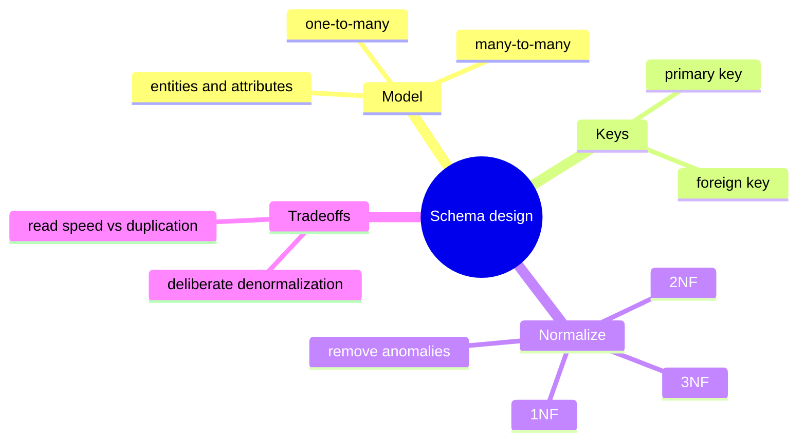

# Stage 2 - Designing a Database

Stage 1 handed you tables and asked you to query them. This stage flips the job: given a description of a business, *you* decide what the tables, columns, and keys should be. Good design is invisible when it works and painful when it does not, so we learn it the honest way - by building a bad schema, watching it break, and fixing it.

:::info Learning objectives
By the end of this stage you will be able to:

- **Define and reshape structure** with DDL - `CREATE`, `ALTER`, `DROP` - and pick the right **constraints** (`NOT NULL`, `UNIQUE`, `PRIMARY KEY`, `FOREIGN KEY`, `CHECK`, `DEFAULT`).
- **Choose keys** deliberately: natural vs **surrogate**, and single-column vs **composite**.
- **Model relationships** from plain-language requirements - one-to-many, many-to-many (via a **join table**), and one-to-one - with correct cardinality.
- **Pick foreign-key behaviour** on delete: `CASCADE`, `RESTRICT`, `SET NULL`.
- **Normalize** a schema to **1NF/2NF/3NF**, recognising the update, insertion, and deletion **anomalies** duplication causes - and **denormalize** on purpose with a measured reason.
- **Package reusable logic** in the database with views, SQL functions, and procedural functions.
:::

## Map of this stage

## The lessons in this stage

First, the build tool for *making* structure:

1. **[DDL - creating and changing tables](./ddl.mdx)** - `CREATE`, `ALTER`, `DROP`, constraints, generated columns, FK cascade options, snapshots, and views.

Then the design judgement for deciding *what* to build:

2. **[Modeling with ER diagrams](./er-modeling.mdx)** - turn requirements into entities, attributes, relationships, and keys; resolve many-to-many with a join table.
3. **[Normalization](./normalization.mdx)** - watch a duplicated table break, then remove the anomalies with 1NF/2NF/3NF - and know when to denormalize on purpose.

Finally, packaging logic in the database:

4. **[Functions and procedures](./functions.mdx)** - reusable logic with SQL functions, PL/pgSQL, and stored procedures (PostgreSQL).

Then prove it stuck:

5. **[Stage 2 review](./assessment.mdx)** - design challenges, a runnable constraint example, a cumulative quiz, and a design cheatsheet.

:::note Status
All five Stage 2 lessons are ready. Work through them in order, or jump to what you need.
:::
