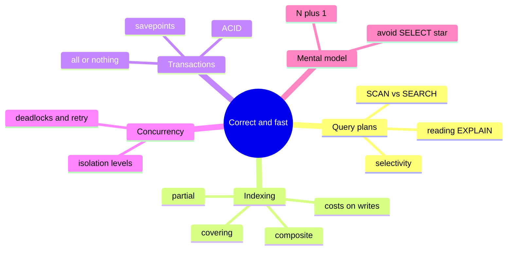

# Stage 3 - Correct and Fast

You can now query and design. This stage is what makes an application *production-ready*: queries that stay fast as data grows, and writes that stay correct when many of them happen at once. These two topics - performance and transactions - are exactly what self-taught learners most often miss, and together they are the early-intermediate milestone.

:::info Learning objectives
By the end of this stage you will be able to:

- **Read a query plan** and tell `SCAN` (full table read) from `SEARCH ... USING INDEX`.
- **Judge selectivity** to predict whether an index will actually help.
- **Design the right index** - composite, covering, or partial - for a given query.
- **Explain the read-speed-versus-write-cost trade-off** of every index you add.
- **Name the isolation anomalies** - dirty, non-repeatable, and phantom reads - and the levels that prevent them.
- **Handle concurrency in production** with deadlock retry loops and savepoints.
:::

## Map of this stage

## The lessons in this stage

1. **[Indexes and query plans](./indexes.mdx)** - read a query plan first (live SCAN-vs-SEARCH demo) and judge selectivity, then design indexes - composite, covering, and partial - plus the N+1 / `SELECT *` execution mental model.
2. **[Transactions and isolation](./transactions.mdx)** - the concurrency anomalies (dirty, non-repeatable, phantom reads), the four isolation levels, how locking and MVCC enforce them, and the deadlocks, retry logic, and savepoints production code needs.
3. **[Stage 3 review](./assessment.mdx)** - cumulative challenges and a quiz that put plans, index design, and concurrency together, plus a cheatsheet to keep.

:::note Status
All three Stage 3 lessons are ready. Transactions were introduced in Stage 1; here we go deeper on concurrency.
:::
