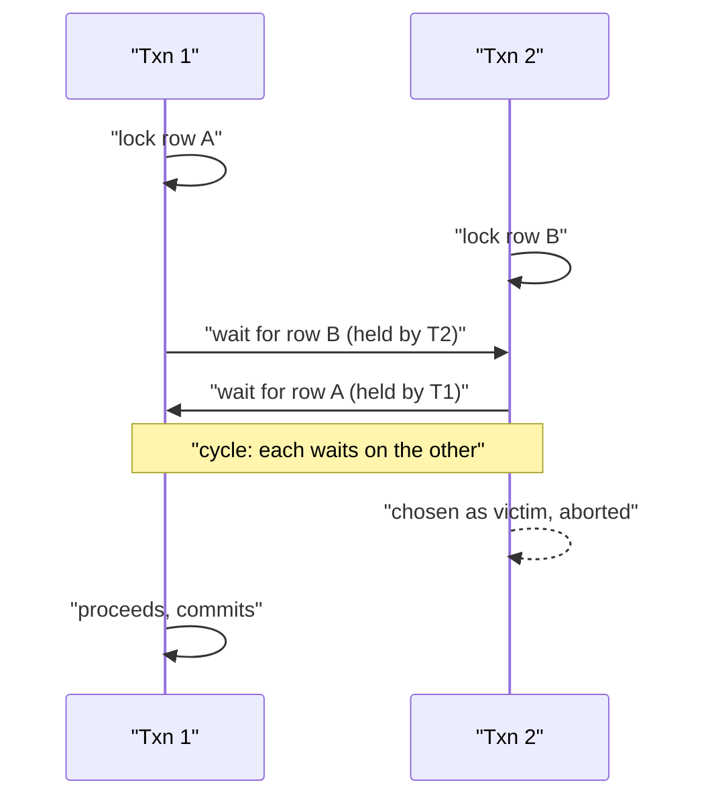

import SqlRunner from '@site/src/components/SqlRunner';
import Quiz from '@site/src/components/Quiz';

# Transactions and isolation

You met **transactions** in Stage 1: a group of changes that all succeed or all roll back, with the [ACID](../00-orientation/intro.mdx#acid-why-relational-databases-are-trusted-with-money) guarantees. The classic case is a transfer - debit one account, credit another, all or nothing:

<SqlRunner
  query={`CREATE TABLE accounts (id INTEGER PRIMARY KEY, balance INTEGER);
INSERT INTO accounts VALUES (1, 100), (2, 0);

BEGIN;
  UPDATE accounts SET balance = balance - 100 WHERE id = 1;
  UPDATE accounts SET balance = balance + 100 WHERE id = 2;
COMMIT;

SELECT * FROM accounts;`}
  height={200}
/>

That is the **A** of ACID. This lesson is about the **I** - *isolation* - which matters the moment **two transactions run at the same time**.

## What goes wrong concurrently

Run a thousand transfers at once and, without protection, transactions can see each other's half-finished work. Three anomalies are worth naming:

- **Dirty read** - T2 reads a row T1 has changed but **not yet committed**. If T1 then rolls back, T2 acted on data that never existed.
- **Non-repeatable read** - T1 reads a row, T2 commits a change to it, T1 reads it **again and gets a different value** within the same transaction.
- **Phantom read** - T1 runs `SELECT ... WHERE ...` twice; between them T2 inserts a matching row, so **new rows appear** the second time.

## Isolation levels

An **isolation level** is the dial that trades safety against concurrency. Each higher level forbids more anomalies, at some cost to throughput. The SQL standard defines four:

| Level | Dirty read | Non-repeatable read | Phantom read |
|---|---|---|---|
| Read Uncommitted | possible | possible | possible |
| Read Committed | prevented | possible | possible |
| Repeatable Read | prevented | prevented | possible* |
| Serializable | prevented | prevented | prevented |

\*PostgreSQL's Repeatable Read also prevents phantoms, via snapshots - stricter than the standard requires.

**Serializable** is the gold standard: the result is guaranteed to match *some* order of running the transactions one after another. You pay for it in concurrency, so you use it where correctness is non-negotiable (money, inventory) and a cheaper level elsewhere.

## How the database enforces it

Two mechanisms, introduced with the ACID isolation point in Stage 0:

- **Locking** (pessimistic) - a transaction locks the rows it touches so others wait. Simple, but contention and deadlocks lurk.
- **MVCC** (multi-version concurrency control, optimistic) - each transaction sees a consistent **snapshot** of the data as of when it started; writers create new versions instead of blocking readers. PostgreSQL, Oracle, and MySQL's InnoDB all use MVCC, which is why **readers don't block writers**.

## Deadlocks: two transactions, opposite order

Locking buys safety but introduces a new failure: a **deadlock**. Two transactions each hold a lock the other needs, and each waits forever. The classic recipe is **acquiring locks in the opposite order**:



The database does not hang. It runs a **deadlock detector**, spots the cycle in the wait-for graph, and **aborts one transaction as the victim** (PostgreSQL raises SQLState `40P01`), rolling it back so the other proceeds. The losing transaction's work is undone - so the **application must catch the error and retry**.

You reduce deadlocks by **always acquiring locks in a consistent order** (e.g. always touch the lower account id first), keeping transactions short, and not holding locks across user think-time.

## Retry logic: expect to be the victim

Because the engine can abort *any* transaction - a deadlock victim, or a serialization failure under Serializable - production code wraps transactions in a **retry loop**. The pattern: retry only on the specific transient error, cap the attempts, and back off **exponentially with jitter** so retriers do not stampede in lockstep.

```python
# Retry a transaction on deadlock / serialization failure (SQLSTATE 40001, 40P01)
import time, random

def run_txn_with_retry(conn, work, max_attempts=5):
    for attempt in range(max_attempts):
        try:
            with conn.transaction():   # BEGIN ... COMMIT, ROLLBACK on error
                return work(conn)
        except SerializationFailure:   # e.g. psycopg errors for 40001 / 40P01
            if attempt == max_attempts - 1:
                raise                  # give up after the last attempt
            # exponential backoff with jitter: 0.1, 0.2, 0.4, ... + random
            sleep = (2 ** attempt) * 0.1 + random.uniform(0, 0.1)
            time.sleep(sleep)
```

The rule: a serialization/deadlock failure is **not a bug** - it is the engine telling you to try again. Retry the *whole* transaction (the rolled-back work is gone), do not just re-run the last statement.

## Savepoints: partial rollback within a transaction

A transaction is all-or-nothing - but a **savepoint** lets you roll back *part* of one without abandoning the whole thing. `SAVEPOINT name` marks a point; `ROLLBACK TO name` undoes everything after it while keeping earlier work and the transaction open; `RELEASE name` discards the marker. This runs in SQLite:

<SqlRunner
  query={`CREATE TABLE cart (id INTEGER PRIMARY KEY, item TEXT);

BEGIN;
  INSERT INTO cart VALUES (1, 'keep me');

  SAVEPOINT sp1;
  INSERT INTO cart VALUES (2, 'undo me');
  ROLLBACK TO sp1;        -- undoes row 2 only, transaction stays open

  INSERT INTO cart VALUES (3, 'keep me too');
COMMIT;

SELECT * FROM cart;       -- rows 1 and 3 survive; row 2 was rolled back`}
  height={260}
/>

Savepoints are how a long transaction tries a risky step and recovers if it fails, without throwing away the work before it - useful for processing a batch where one bad item should not sink the rest.

## A read-side alternative: materialized views

When a read is slow because it aggregates or joins a lot, raising the isolation level will not help - the work is just expensive. A **materialized view** stores the *result* of a query on disk, like a snapshot you refresh on a schedule, so reads hit precomputed rows instead of recomputing every time. It is a read-optimization, not a concurrency tool (PostgreSQL):

```sql
-- PostgreSQL: precompute an expensive aggregate, refresh on a schedule
CREATE MATERIALIZED VIEW customer_totals AS
  SELECT customer_id, SUM(total) AS lifetime_total
  FROM orders
  GROUP BY customer_id;

-- reads are now a cheap lookup; refresh when the data changes
REFRESH MATERIALIZED VIEW customer_totals;
```

The trade-off is the familiar one: the stored result is stale between refreshes. Use it for dashboards and reports that tolerate slight lag, not for data that must be exact to the second.

:::note Dialect note
Materialized views are server-side (PostgreSQL, Oracle, SQL Server's indexed views) and do **not** run in this SQLite sandbox. A plain `CREATE VIEW` (Stage 2) stores the *query* and is always live; a materialized view stores the *rows* and must be refreshed.
:::

## In practice (2026)

- Defaults differ: **PostgreSQL, Oracle, and SQL Server default to Read Committed**; **MySQL/InnoDB defaults to Repeatable Read**. Know your engine's default - it shapes what anomalies your code can hit.
- **Serializable is cheaper than it used to be.** PostgreSQL's Serializable Snapshot Isolation (SSI) makes true serializability practical for correctness-critical paths, rather than a last resort.
- **SQLite** (this sandbox) sidesteps the dial: it allows only **one writer at a time**, so write transactions are effectively serialized. Concurrency tuning there is about WAL mode and busy-timeouts, not isolation levels.

Rule of thumb: start at your engine's default, and raise the level only for the specific transactions whose correctness demands it.

## Quick quiz

<Quiz
  title="Transactions and isolation"
  questions={[
    {
      prompt: "A transaction reads a row that another transaction has changed but not yet committed. What is that?",
      options: [
        {text: "A dirty read", correct: true},
        {text: "A phantom read", correct: false},
        {text: "A deadlock", correct: false},
        {text: "A non-repeatable read", correct: false},
      ],
      explanation: "Reading uncommitted changes is a dirty read - dangerous because the other transaction may still roll back.",
    },
    {
      prompt: "Which isolation level guarantees the result equals some serial order of the transactions?",
      options: [
        {text: "Serializable", correct: true},
        {text: "Read Committed", correct: false},
        {text: "Read Uncommitted", correct: false},
        {text: "Repeatable Read", correct: false},
      ],
      explanation: "Serializable is the strictest level: as if the transactions ran one at a time. It costs the most concurrency, so reserve it for correctness-critical work.",
    },
    {
      prompt: "What does MVCC give you that pure locking does not?",
      options: [
        {text: "Readers see a consistent snapshot without blocking writers", correct: true},
        {text: "Indexes that never need maintenance", correct: false},
        {text: "Automatic schema migrations", correct: false},
        {text: "Guaranteed row ordering", correct: false},
      ],
      explanation: "MVCC versions rows so each transaction reads a snapshot; readers and writers don't block each other - a key reason it's the common choice.",
    },
    {
      prompt: "Two transactions deadlock - each holds a lock the other needs. What does the database do?",
      options: [
        {text: "Detects the cycle and aborts one as a victim; the app should retry it", correct: true},
        {text: "Waits until one finishes naturally", correct: false},
        {text: "Commits both halfway", correct: false},
        {text: "Crashes the connection pool", correct: false},
      ],
      explanation: "A deadlock detector spots the wait-for cycle and rolls back one transaction. Its work is undone, so the application must catch the error and retry the whole transaction.",
    },
    {
      prompt: "Your retry loop hits a serialization failure. What is the right backoff?",
      options: [
        {text: "Exponential backoff with jitter, capped at a max number of attempts", correct: true},
        {text: "Retry instantly in a tight loop forever", correct: false},
        {text: "Wait a fixed long time, retry once", correct: false},
        {text: "Re-run only the last failed statement, not the transaction", correct: false},
      ],
      explanation: "Exponential backoff with jitter avoids a thundering herd; cap the attempts so a truly stuck txn gives up. Retry the whole transaction - the rolled-back work is gone.",
    },
    {
      prompt: "Inside an open transaction you want to undo just the last few statements, not all of it. What do you use?",
      options: [
        {text: "SAVEPOINT, then ROLLBACK TO that savepoint", correct: true},
        {text: "COMMIT then BEGIN again", correct: false},
        {text: "DROP TABLE", correct: false},
        {text: "Raise the isolation level", correct: false},
      ],
      explanation: "A savepoint marks a point; ROLLBACK TO it undoes only later work and keeps the transaction open. A full ROLLBACK would discard everything.",
    },
    {
      prompt: "A dashboard query is slow because it aggregates many rows. Which tool helps most?",
      options: [
        {text: "A materialized view - store the precomputed result, refresh on a schedule", correct: true},
        {text: "A higher isolation level", correct: false},
        {text: "A dirty read", correct: false},
        {text: "A savepoint", correct: false},
      ],
      explanation: "Materialized views precompute and store expensive results so reads are cheap lookups. The cost is staleness between refreshes - fine for dashboards, not exact-to-the-second data.",
    },
    {
      prompt: "What's the practical advice on isolation levels?",
      options: [
        {text: "Start at the engine's default; raise the level only for transactions that need it", correct: true},
        {text: "Always use Read Uncommitted for speed", correct: false},
        {text: "Always use Serializable everywhere", correct: false},
        {text: "Isolation level has no effect on correctness", correct: false},
      ],
      explanation: "Higher levels cost concurrency, lower levels risk anomalies. Default for most, escalate the specific critical transactions.",
    },
  ]}
/>

:::tip Next up
Your app is now correct and fast. **Stage 4 - Databases in Real Apps** covers shipping it: ORMs, migrations, connection pooling, and the [access control](../04-real-apps/dcl.mdx) you saw with DCL.
:::
