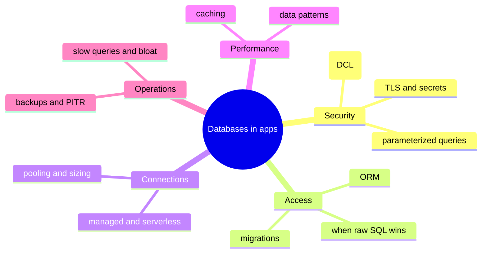

# Stage 4 - Databases in Real Apps

A database almost never lives alone. It sits behind an application, gets changed by a team over months, and runs on infrastructure someone has to operate. This stage covers the practical band that academic courses routinely skip and that real projects cannot - the difference between knowing SQL and shipping a maintainable system.

:::info Learning objectives
By the end of this stage you can:

- Grant least-privilege access with roles, and write queries that resist SQL injection.
- Integrate a database through an ORM, and know when to drop to raw SQL.
- Evolve a schema safely with versioned, zero-downtime migrations.
- Keep connections healthy under load, and secure them with TLS and managed secrets.
- Cache reads and reason about invalidation.
- Operate a database: slow queries, bloat, backups with PITR, and what to alert on.
- Apply the patterns real apps depend on - pagination, soft deletes, idempotency, auditing, search.
:::

## Map of this stage

## The lessons in this stage

1. **[Access control - DCL](./dcl.mdx)** - roles, `GRANT`/`REVOKE`, least privilege, and modern PostgreSQL security defaults.
2. **[SQL injection and safe queries](./sql-injection.mdx)** - the top database vulnerability, demonstrated live, and how parameterized queries stop it.
3. **[ORMs and migrations](./orms-migrations.mdx)** - talking to the database as objects (and when to drop to raw SQL), and evolving the schema safely with versioned migrations.
4. **[Connections and serverless](./connections.mdx)** - why connections are expensive, pooling and its sizing, the serverless problem, securing connections with TLS, and managing secrets.
5. **[Caching](./caching.mdx)** - cache-aside, write strategies, TTLs, and the invalidation problem.
6. **[Operating a database](./ops.mdx)** - slow-query analysis, autovacuum and bloat, replication lag, backups with PITR (RPO/RTO), and observability.
7. **[Common data patterns](./app-patterns.mdx)** - pagination, soft deletes, idempotency, auditing, and full-text search.
8. **[Stage 4 review](./assessment.mdx)** - applied scenarios, a cumulative quiz, and a practitioner cheatsheet.

:::note Status
All eight Stage 4 lessons are ready.
:::
