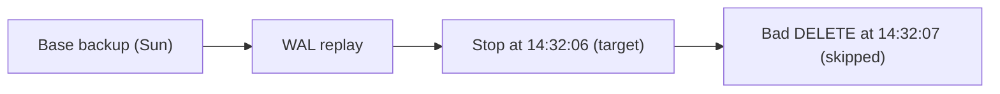
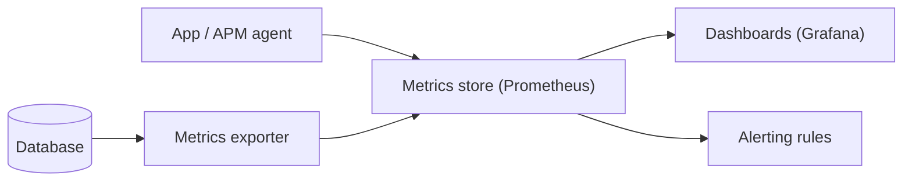

import Quiz from '@site/src/components/Quiz';

# Operating a database

Shipping the app is not the end. A production database has to stay **fast**, **recoverable**, and **observable** for years. This lesson is the operations band - the work that keeps a database healthy after launch. It is practical, not a checklist: each topic is something you will actually reach for when a real system misbehaves.

## Finding the slow queries

When a database "feels slow", the cause is almost always a handful of queries doing too much work too often. Find them before you guess.

PostgreSQL's **`pg_stat_statements`** extension aggregates every query by shape (literals stripped out), so you can rank them:

```sql
-- the queries burning the most total time
SELECT query,
       calls,
       round(mean_exec_time::numeric, 1) AS avg_ms,
       round(total_exec_time::numeric, 0) AS total_ms
FROM pg_stat_statements
ORDER BY total_exec_time DESC
LIMIT 10;
```

Read it by **total time, not average**. A query taking 5 ms but run a million times hurts more than a 2-second report run twice a day - and is usually easier to fix. The slow log (`log_min_duration_statement = 500` logs anything over 500 ms) catches the individual slow executions that aggregates hide, including the exact parameters.

Once you have a suspect, run **`EXPLAIN (ANALYZE, BUFFERS)`** on it (the planner tools from [Stage 3](../03-correct-and-fast/indexes.mdx)) to see *why* it is slow - usually a sequential scan that wants an index, or a join exploding row counts.

:::tip The loop
Measure with `pg_stat_statements` -> explain the worst offender -> fix it (index, rewrite, or cache) -> re-measure. Optimising a query that was never expensive is wasted effort.
:::

## Autovacuum, VACUUM, and bloat

PostgreSQL never overwrites a row in place. An `UPDATE` or `DELETE` leaves the old version behind as a **dead tuple**, invisible to new transactions but still on disk. Left alone, dead tuples accumulate as **bloat** - tables and indexes grow, scans read more pages, and performance decays even though the live row count is flat.

- **`VACUUM`** reclaims space from dead tuples so it can be reused.
- **`ANALYZE`** refreshes the table statistics the planner relies on; stale stats produce bad plans (it thinks a table has 1,000 rows when it has 10 million).
- **Autovacuum** runs both automatically in the background, triggered when a table's dead-tuple fraction crosses a threshold.

Autovacuum handles most cases, but on a **high-churn table** it can fall behind - the table mutates faster than vacuum cleans it. Symptoms: a table far larger than its live data, climbing query times, and an old `relfrozenxid`. Check what is happening:

```sql
SELECT relname,
       n_live_tup,
       n_dead_tup,
       last_autovacuum
FROM pg_stat_user_tables
ORDER BY n_dead_tup DESC
LIMIT 10;
```

The fix is usually to **tune autovacuum to run more aggressively** on that table (lower `autovacuum_vacuum_scale_factor`), not to disable it. `VACUUM FULL` rewrites the table to fully reclaim space but takes an exclusive lock - reserve it for emergencies.

## Replication and lag

Most production setups run **replicas**: a primary takes writes and streams its WAL to one or more standbys that stay in sync and can serve reads or take over on failure. The number that matters operationally is **replication lag** - how far behind the primary a replica is.

Lag is dangerous in two ways. If you route reads to a replica, a lagging replica serves **stale data** - a user updates their profile, reads it back from a behind replica, and sees the old value. And if the primary fails while a replica is far behind, failover **loses** whatever had not replicated yet. Monitor it as a first-class metric:

```sql
-- run on a replica: how many seconds behind the primary?
SELECT now() - pg_last_xact_replay_timestamp() AS replication_lag;
```

Alert when lag exceeds your tolerance (often seconds). Common causes: a write spike, a long-running query on the replica blocking WAL replay, or network saturation.

## Backups and point-in-time recovery

Two backup kinds, used together:

- **Logical backup** - a dump of data as SQL (`pg_dump`). Portable and selective, but slow to restore at scale.
- **Physical backup** - a byte-level copy or snapshot of the data files. Fast for large databases.

The capability that matters most is **point-in-time recovery (PITR)**: keep a base physical backup plus the archived **write-ahead log** (the same WAL from [Stage 3](../03-correct-and-fast/transactions.mdx)), and you can restore to *any moment* - for instance, the second before a bad `DELETE` ran.

### A PITR setup, step by step

PITR has two halves: a **base backup** plus **continuous WAL archiving**. Set both up once, then they run forever.

**1. Archive WAL continuously.** Tell PostgreSQL to copy each completed WAL segment somewhere durable (object storage, a separate disk) as it is filled:

```text
# postgresql.conf
wal_level = replica
archive_mode = on
archive_command = 'test ! -f /archive/%f && cp %p /archive/%f'
```

Every change since the base backup now lands in the archive. This is what shrinks your **RPO** toward seconds.

**2. Take a base backup.** `pg_basebackup` streams a consistent physical copy of the whole cluster:

```text
pg_basebackup -h db.example.com -U replicator \
  -D /backups/base-2026-06-18 -Ft -z -Xs -P
```

On a managed platform this is the **automated snapshot** the provider takes for you - same idea, no command to run.

**3. Repeat the base backup on a schedule.** A weekly or daily base, plus the WAL between bases, keeps restores fast: the older the base, the more WAL must replay.

### Restoring to a point in time

Now the payoff. Say a bad `DELETE FROM orders` ran at `2026-06-18 14:32:07`. Recover to the instant *before* it:

**1. Restore the most recent base backup** taken *before* the target time into a fresh data directory:

```text
tar -xzf /backups/base-2026-06-18/base.tar.gz -C /var/lib/postgresql/restore
```

**2. Point PostgreSQL at the WAL archive and set the target.** Tell it where to fetch archived WAL and exactly how far to replay:

```text
# postgresql.conf (in the restored data dir)
restore_command = 'cp /archive/%f %p'
recovery_target_time = '2026-06-18 14:32:06'
recovery_target_action = 'promote'
```

```text
# signal recovery mode, then start the server
touch /var/lib/postgresql/restore/recovery.signal
```

**3. Start the server.** PostgreSQL replays the base, then **replays WAL** segment by segment, stopping at `recovery_target_time`. The bad `DELETE` is never applied. When it reaches the target it **promotes** to a normal read/write database.



The restored cluster contains everything up to the target second and nothing after - the deletion is undone.

:::warning A backup you have never restored is not a backup
The only proof PITR works is a **scheduled test restore** to a scratch server: restore the base, replay WAL to a chosen time, and verify the data. Time it, so you know your true **RTO**. Plenty of teams discover a corrupt, incomplete, or impossibly slow backup only during a live outage. Drill it.
:::

Two numbers define your recovery goals, and they drive every backup decision:

- **RPO (Recovery Point Objective)** - how much data you can afford to lose, measured in time. Nightly dumps mean an RPO of up to 24 hours; continuous WAL archiving pushes RPO toward seconds.
- **RTO (Recovery Time Objective)** - how long you can afford to be down while restoring. A 2 TB logical restore that takes 6 hours fails a 1-hour RTO no matter how good the backup is.

```text
nightly dump only       -> RPO ~24h,  RTO = hours (slow restore)
base backup + WAL (PITR) -> RPO ~seconds, RTO = minutes-to-hours
+ warm standby           -> RPO ~seconds, RTO = seconds (failover)
```

## Observability and alerting

You cannot fix what you cannot see. Beyond the database's own `pg_stat_*` views, ship metrics to a time-series stack (Prometheus + Grafana, or a managed APM) and watch trends, not snapshots.



Track request latency as **percentiles, never averages**. An average hides pain: a p50 of 20 ms looks fine while the **p99** sits at 3 seconds, meaning 1 in 100 users has a terrible experience. Averages also get dragged around by outliers; percentiles tell you what a *given fraction* of users actually feel.

What is worth an alert (page someone) versus a dashboard (look when curious):

- **Alert on symptoms users feel or that threaten data**: rising p99 latency, error rate, replication lag past tolerance, disk above ~80%, connections near the limit ([pool trouble](./connections.mdx)).
- **Dashboard the diagnostics**: cache hit ratio, dead-tuple counts, slowest queries, vacuum activity.

Alert on the few things that mean "users are hurting or we are about to lose data". Paging on everything trains people to ignore pages.

## In 2026: managed does a lot, not everything

Managed and serverless platforms (Stage 0's "where databases live") handle automated backups, WAL archiving, failover, patching, and dashboards for you. What they do **not** remove is your responsibility to **test restores**, **set RPO/RTO targets and retention**, **read the slow-query reports**, and **decide what to alert on**. They automate the chores; the judgement is still yours.

## Quick quiz

<Quiz
  title="Operating a database"
  questions={[
    {
      prompt: "When ranking queries in pg_stat_statements, which metric best finds what to optimise first?",
      options: [
        {text: "Total execution time across all calls", correct: true},
        {text: "The single slowest call ever recorded", correct: false},
        {text: "The query with the longest text", correct: false},
        {text: "The most recently run query", correct: false},
      ],
      explanation: "A fast query run millions of times can dominate total time. Rank by total_exec_time, then explain and fix the top offenders.",
    },
    {
      prompt: "Why does a high-churn PostgreSQL table grow even when its live row count is steady?",
      options: [
        {text: "Updates and deletes leave dead tuples (bloat) until VACUUM reclaims them", correct: true},
        {text: "Indexes duplicate every row automatically", correct: false},
        {text: "ANALYZE writes a copy of the table", correct: false},
        {text: "Replicas push extra rows back to the primary", correct: false},
      ],
      explanation: "PostgreSQL keeps old row versions as dead tuples. VACUUM (usually via autovacuum) reclaims that space; if autovacuum falls behind, bloat grows.",
    },
    {
      prompt: "What is the operational risk of routing reads to a lagging replica?",
      options: [
        {text: "Stale reads - users may see data older than the latest write", correct: true},
        {text: "The primary stops accepting writes", correct: false},
        {text: "Indexes are dropped on the replica", correct: false},
        {text: "Backups become impossible", correct: false},
      ],
      explanation: "A replica behind the primary serves older data, so a read-after-write can return a stale value. High lag also risks data loss on failover.",
    },
    {
      prompt: "What do RPO and RTO measure?",
      options: [
        {text: "RPO = how much data you can lose; RTO = how long recovery may take", correct: true},
        {text: "RPO = restore speed; RTO = backup size", correct: false},
        {text: "Both measure replication lag", correct: false},
        {text: "RPO = read latency; RTO = write latency", correct: false},
      ],
      explanation: "RPO bounds data loss (drives backup frequency / WAL archiving); RTO bounds downtime (drives restore strategy and standbys).",
    },
    {
      prompt: "Why watch p99 latency instead of average latency?",
      options: [
        {text: "Averages hide a slow tail; p99 shows what the worst-off users actually experience", correct: true},
        {text: "p99 is cheaper to compute", correct: false},
        {text: "Averages are always inaccurate", correct: false},
        {text: "p99 includes only successful requests", correct: false},
      ],
      explanation: "A good average can coexist with a terrible tail. Percentiles reveal that, say, 1 in 100 requests is slow - the experience users actually complain about.",
    },
  ]}
/>

:::tip Next up
**[Common data patterns](./app-patterns.mdx)** - the recurring schema and query patterns every real application reaches for: pagination, soft deletes, idempotency, auditing, and full-text search.
:::
