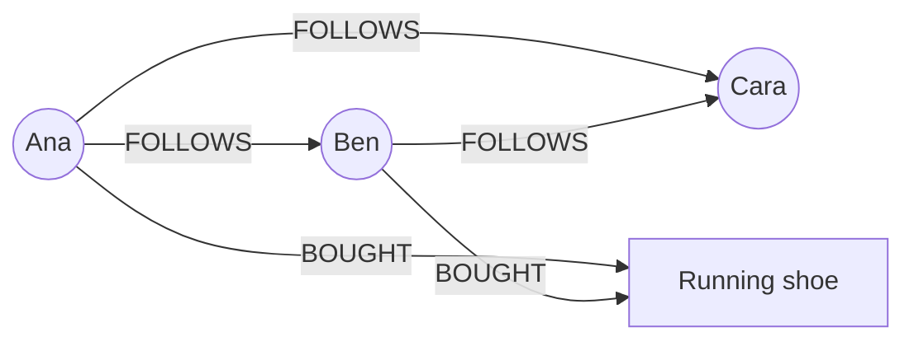

import SqlRunner from '@site/src/components/SqlRunner';
import Quiz from '@site/src/components/Quiz';

# Graph and time-series databases

The [NoSQL modeling](./nosql-modeling.mdx) lesson named graph and wide-column stores. Two specialized engines deserve a hands-on look, because each is the obvious winner for a data shape that relational design handles badly: **graph databases** for relationship-heavy data, and **time-series databases** for streams of timestamped measurements.

## Graph databases: relationships as first-class data

A **graph database** stores **nodes** (entities), **edges** (relationships), and **properties** (key-value attributes on either). The relationship is not a foreign key you join on later - it is stored directly and traversed in constant time per hop.



This shines for questions about **connections**: friends-of-friends, recommendations, fraud rings, dependency chains.

### Querying with Cypher

**Cypher** is the most common graph query language (Neo4j's, and the basis for the new standard). It draws the pattern you want as ASCII art - `(node)-[:REL]->(node)` - and the engine finds matches.

**Friends of friends Ana does not already follow:**

```cypher
MATCH (ana:Person {name: 'Ana'})-[:FOLLOWS]->(friend)-[:FOLLOWS]->(fof)
WHERE NOT (ana)-[:FOLLOWS]->(fof) AND fof <> ana
RETURN DISTINCT fof.name
```

**"People who bought this also bought" recommendation:**

```cypher
MATCH (ana:Person {name: 'Ana'})-[:BOUGHT]->(product)<-[:BOUGHT]-(other)
MATCH (other)-[:BOUGHT]->(suggestion)
WHERE NOT (ana)-[:BOUGHT]->(suggestion)
RETURN suggestion.name, count(*) AS strength
ORDER BY strength DESC
```

### Contrast: the SQL recursive-join pain

The same friends-of-friends question in SQL needs a self-join per hop, or a recursive CTE that walks the edge table. Run it against a tiny `follows` table (Ana is `1`) - the CTE seeds Ana's direct follows at depth 1, then takes one more hop to depth 2:

<SqlRunner
  query={`WITH RECURSIVE reachable(person_id, depth) AS (
  SELECT followee_id, 1
  FROM follows WHERE follower_id = 1   -- Ana
  UNION ALL
  SELECT f.followee_id, r.depth + 1
  FROM follows f
  JOIN reachable r ON f.follower_id = r.person_id
  WHERE r.depth < 2
)
SELECT DISTINCT person_id FROM reachable WHERE depth = 2;`}
  schema={`CREATE TABLE follows (
  follower_id INTEGER,
  followee_id INTEGER,
  PRIMARY KEY (follower_id, followee_id)
);
INSERT INTO follows VALUES
  (1, 2),  -- Ana follows Ben
  (1, 3),  -- Ana follows Cara
  (2, 3),  -- Ben follows Cara
  (2, 4),  -- Ben follows Dave
  (3, 5);  -- Cara follows Eve`}
  height={260}
/>

Every extra hop is another join or another recursion level, and performance degrades fast as the graph deepens. In a graph database, a hop is just following a stored pointer - **traversal depth is cheap**. That is the whole reason the category exists.

:::note Property graph vs RDF, and the GQL standard
Two graph models exist. The **property graph** (Neo4j, used above) puts properties on nodes and edges - the pragmatic, mainstream choice. **RDF** (triple stores) models everything as `subject-predicate-object` triples, queried with **SPARQL**, and underpins the semantic web and knowledge graphs.

Until recently graph querying had no SQL-like standard. **GQL (ISO/IEC 39075), ratified in 2024**, is the first new ISO database query language since SQL - a Cypher-derived standard for property graphs. It is doing for graph queries what SQL did for relational.
:::

## Time-series databases: optimized for the clock

A **time-series database (TSDB)** is built for data that arrives as a continuous stream of timestamped points: **metrics, sensor readings, logs, financial ticks, IoT telemetry**. The defining trait is that **time is the primary axis** - data is almost always written in time order and queried over time ranges.

### What they optimize

- **Time-ordered ingest** - append-heavy, write-once. New points arrive at the "now" end, so storage is tuned for high-throughput sequential writes, not random updates.
- **Downsampling** - roll raw points up to coarser intervals (per-second to per-minute to per-hour) so old data stays queryable without storing every point forever.
- **Retention and TTL** - automatically drop or archive data past an age. You rarely need per-second metrics from two years ago.
- **Continuous aggregates** - pre-computed, incrementally maintained rollups (hourly averages) so dashboards read a small summary instead of scanning raw points.
- **Time-bucketing functions** - first-class operators to group by arbitrary time windows, the query you run constantly.

### Engines

- **TimescaleDB** - a PostgreSQL extension. You keep SQL, your tooling, and joins to relational tables, and gain hypertables, compression, and continuous aggregates.
- **InfluxDB** - a purpose-built TSDB with its own ingest protocol and query languages, popular for infrastructure and IoT metrics.
- **Prometheus** - a metrics-focused TSDB tightly tied to monitoring and alerting.

:::tip Postgres + Timescale is often enough
As with vectors and JSON, you usually do not need a separate system. If you already run PostgreSQL, **TimescaleDB** turns it into a capable time-series store while keeping SQL and your relational data in one place. Reach for a dedicated TSDB only when ingest volume or specialized features genuinely demand it - the same "use what you run" judgment that recurs across this stage.
:::

## Quick quiz

<Quiz
  title="Graph and time-series"
  questions={[
    {
      prompt: "Why is a graph database better than SQL for 'friends of friends'?",
      options: [
        {text: "Relationships are stored directly, so each hop is a cheap pointer follow, not another join", correct: true},
        {text: "It uses less disk space than any relational table", correct: false},
        {text: "SQL cannot express the query at all", correct: false},
        {text: "Graph databases never need indexes", correct: false},
      ],
      explanation: "Graph traversal follows stored edges, so depth is cheap. SQL needs a self-join or recursive CTE per hop, which degrades as the graph deepens.",
    },
    {
      prompt: "What does the new GQL standard (2024) do?",
      options: [
        {text: "Standardizes a query language for property graphs, like SQL did for relational", correct: true},
        {text: "Replaces SQL for relational databases", correct: false},
        {text: "Defines how to store JSON columns", correct: false},
        {text: "Is a new sharding protocol", correct: false},
      ],
      explanation: "GQL (ISO/IEC 39075) is the first new ISO query-language standard since SQL - a Cypher-derived standard for property graphs.",
    },
    {
      prompt: "When should you reach for a time-series database?",
      options: [
        {text: "For streams of timestamped data - metrics, sensors, logs - queried over time ranges", correct: true},
        {text: "For storing relationships between users", correct: false},
        {text: "For variable, sparse per-row attributes", correct: false},
        {text: "For enforcing foreign keys", correct: false},
      ],
      explanation: "TSDBs optimize time-ordered ingest, downsampling, retention, and continuous aggregates for timestamped streams. Graphs handle relationships.",
    },
    {
      prompt: "What does a continuous aggregate give a time-series database?",
      options: [
        {text: "Pre-computed, incrementally maintained rollups so dashboards read summaries, not raw points", correct: true},
        {text: "A way to store nodes and edges", correct: false},
        {text: "Stronger consistency during partitions", correct: false},
        {text: "Automatic sharding across nodes", correct: false},
      ],
      explanation: "Continuous aggregates maintain rolled-up summaries (e.g. hourly averages) incrementally, so queries scan a small summary instead of every raw point.",
    },
  ]}
/>

:::tip Next up
**[JSON in a relational database](./json.mdx)** - document-style flexibility without leaving SQL, the convergence story made hands-on.
:::
