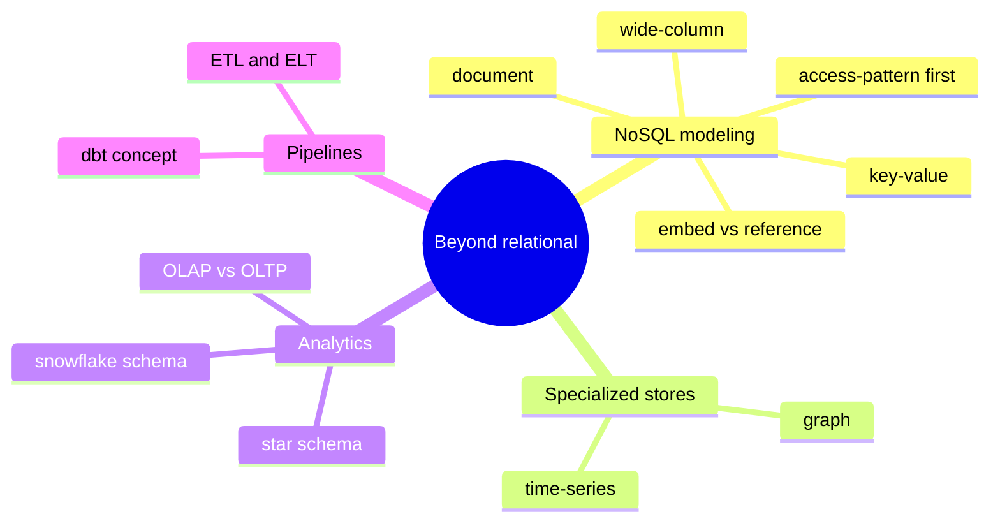

# Stage 5 - Beyond Relational

Stage 0 named the NoSQL families and the OLTP/OLAP split. Now that you can design and query relational schemas, those alternatives make far more sense, because you can see them as deliberate departures from rules you already understand. This stage is about choosing the right store and modeling data the way that store wants.

:::info Learning objectives
By the end of this stage you can:

- Tell a transactional (OLTP) workload from an analytical (OLAP) one, and place each on the right system.
- Shape an analytical warehouse with fact and dimension tables, and choose ETL vs ELT.
- Model data idiomatically for document, key-value, wide-column, and graph stores - deciding when to embed and when to reference.
- Recognize when a graph or time-series store fits better than relational.
- Store and query JSON in a relational database, and judge JSON columns vs real columns.
:::

## Map of this stage

## The lessons in this stage

1. **[Transactional vs analytical (OLTP & OLAP)](./oltp-olap.mdx)** - why running the business and understanding it need different schemas, storage, and systems, plus the 2026 analytics landscape.
2. **[Warehousing](./warehousing.mdx)** - fact and dimension tables, star vs snowflake schemas, and ETL vs ELT pipelines.
3. **[Modeling for NoSQL](./nosql-modeling.mdx)** - access-pattern-first design, embedding vs referencing, and the modeling idioms of document, key-value, wide-column, and graph stores - contrasted with Stage 2's normalization.
4. **[Graph and time-series databases](./graph-and-timeseries.mdx)** - two specialized stores, hands-on: graph traversal with Cypher (and the 2024 GQL standard), and time-series engines for metrics, sensors, and logs.
5. **[JSON in a relational database](./json.mdx)** - store and query JSON columns in SQL: the convergence of relational and document models, hands-on.
6. **[Stage 5 review](./assessment.mdx)** - model-choice scenarios, a runnable graph-in-SQL example, a cumulative quiz, and a cheatsheet.

:::note Status
All six Stage 5 lessons are ready.
:::
