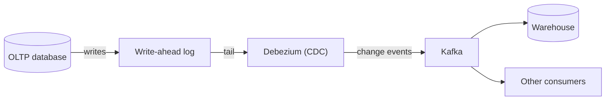

import SqlRunner from '@site/src/components/SqlRunner';
import Quiz from '@site/src/components/Quiz';

# Transactional vs analytical: OLTP & OLAP

[Stage 0](../00-orientation/intro.mdx) introduced two workloads. Here is why they pull database design in opposite directions.

- **OLTP (Online Transaction Processing)** *runs* the business: many small, fast reads and writes - place an order, update a profile.
- **OLAP (Online Analytical Processing)** *understands* the business: a few huge questions over lots of history - "average revenue per region last quarter."

## OLTP: optimized for correct writes

Transactional systems handle thousands of tiny operations a second, each touching a few rows. They use a **normalized** schema - each fact stored once, tables linked by keys - so writes stay fast and consistent and there is no duplicated data to drift out of sync. Data is stored **by row**, because a transaction reads or writes a whole record at a time. PostgreSQL and MySQL are built for this.

## OLAP: optimized for fast reads over history

Analytical systems answer a handful of sweeping questions across millions or billions of rows. They favour a **denormalized** schema - often a **star schema**, where a central fact table (sales) joins to descriptive dimension tables (date, product, region). Duplication is fine, because the goal is to avoid expensive joins and scan fast. Data is stored **by column**, so a query that sums one column reads only that column, not whole rows. Tools: Snowflake, BigQuery, ClickHouse, DuckDB.

An analytical question looks like this - run it against the sandbox to feel the difference from a single-row lookup:

<SqlRunner
  query={`SELECT customers.country,
       COUNT(*)        AS order_count,
       SUM(orders.total) AS revenue
FROM orders
JOIN customers ON customers.id = orders.customer_id
GROUP BY customers.country
ORDER BY revenue DESC;`}
  height={160}
/>

## Side by side

| | OLTP | OLAP |
|---|---|---|
| Purpose | Run the business | Understand the business |
| Workload | Many small reads/writes | Few large aggregations |
| Schema | Normalized | Denormalized (star schema) |
| Storage | By row | By column |
| Data | Current, live | Historical, lots of it |
| Users | Apps and customers | Analysts and dashboards |
| Example | "Place this order" | "Revenue by region last quarter" |

A clean mnemonic: **OLTP records what happens; OLAP explains what happened.**

## Two systems, one data flow

You do not run big analytical queries on the live transactional database - they are slow and compete with real traffic. Instead, data is copied from OLTP into an analytical store on a schedule. The modern default is **ELT** (Extract, Load, **then** Transform): load raw data into the warehouse and transform it there with a tool like **dbt**, rather than transforming before loading (the older ETL order).

### Change Data Capture: streaming instead of batching

Batch ETL/ELT copies the whole source (or all changed rows) on a schedule - say nightly. That leaves the warehouse hours stale and re-scans data that did not change. **Change Data Capture (CDC)** fixes both by capturing *only what changed, as it changes*.

**Log-based CDC** reads the source database's **write-ahead log** (the [WAL](../06-scaling/consistency.mdx), the same log that already records every insert, update, and delete for durability and replication). A tool like **Debezium** tails that log and emits each change as an event - no extra load on the source, and nothing is missed.

Those events flow through a streaming platform (Kafka) and feed the warehouse - or any consumer - in near real time. This turns the slow nightly batch into a continuous stream, and the same change feed can drive cache invalidation, search indexing, or microservices, not just analytics.

- **Batch ETL/ELT** - simple, runs on a schedule, but stale between runs and re-reads unchanged data.
- **Log-based CDC** - near real-time, low source overhead, captures every change exactly once - at the cost of more moving parts (a streaming platform to operate).

## The 2026 landscape

- **Cloud warehouses** (Snowflake, BigQuery, Amazon Redshift, Databricks SQL, Microsoft Fabric) separate **storage from compute**, so you scale query power up and down and pay for what you use.
- **Columnar engines** (ClickHouse, Apache Druid) power real-time analytics; **DuckDB** brings warehouse-grade analytics to a single file on your laptop - an embedded OLAP engine, the analytical counterpart to SQLite.
- **The lakehouse** blends a data lake with warehouse features over open table formats - **Apache Iceberg** and Delta Lake - so one copy of the data serves many engines.
- **The line is blurring.** **HTAP** systems (SingleStore, TiDB, Google AlloyDB) and columnar extensions for PostgreSQL aim to serve transactional and analytical queries from one place - though dedicated systems still win at the extremes.

## Quick quiz

<Quiz
  title="OLTP and OLAP"
  questions={[
    {
      prompt: "What is the primary purpose of OLTP?",
      options: [
        {text: "Managing and processing real-time transactional data", correct: true},
        {text: "Analyzing large volumes of historical data", correct: false},
        {text: "Supporting complex business-intelligence queries", correct: false},
        {text: "Storing aggregated data for reporting", correct: false},
      ],
      explanation: "OLTP runs the business: many small, fast transactions. The other options describe OLAP.",
    },
    {
      prompt: "Which data structure best fits an OLAP database?",
      options: [
        {text: "Denormalized, to make complex analysis and scans fast", correct: true},
        {text: "Highly normalized, to optimize transactional writes", correct: false},
        {text: "Key-value pairs for single-key lookups", correct: false},
        {text: "Whatever the application happens to use", correct: false},
      ],
      explanation: "OLAP denormalizes (often a star schema) to avoid costly joins and scan quickly. Heavy normalization is the OLTP choice, for fast, consistent writes.",
    },
    {
      prompt: "Why store analytical data by column rather than by row?",
      options: [
        {text: "A query that aggregates one column reads only that column, not whole rows", correct: true},
        {text: "Column storage enforces foreign keys better", correct: false},
        {text: "It makes single-row inserts faster", correct: false},
        {text: "It uses no disk space", correct: false},
      ],
      explanation: "Columnar storage lets wide aggregations touch just the needed columns - ideal for OLAP. Row storage suits OLTP, which reads/writes whole records.",
    },
    {
      prompt: "In modern pipelines, what does the 'ELT' order mean?",
      options: [
        {text: "Load raw data into the warehouse first, then transform it there", correct: true},
        {text: "Transform data fully before loading it anywhere", correct: false},
        {text: "Encrypt, load, then test", correct: false},
        {text: "Export live tables to the app layer", correct: false},
      ],
      explanation: "ELT loads raw data then transforms in-warehouse (often with dbt), exploiting cheap warehouse compute - a shift from the older ETL order.",
    },
  ]}
/>

:::tip Next up
**[Warehousing](./warehousing.mdx)** - how analytical data is shaped (star schemas) and moved (ETL vs ELT).
:::
