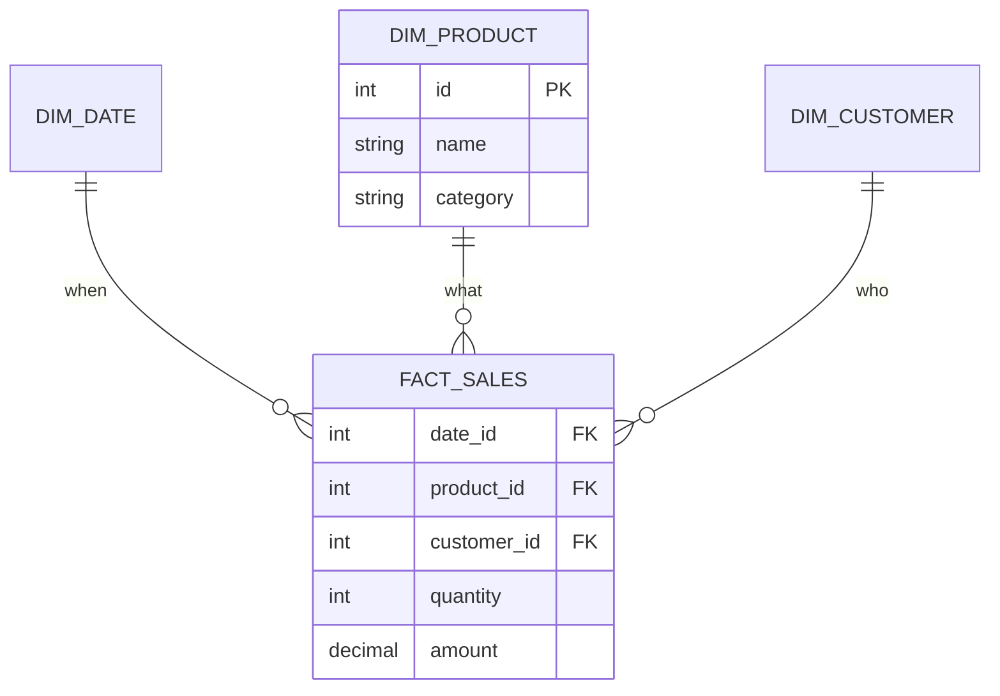

import Quiz from '@site/src/components/Quiz';

# Warehousing: star schemas and ELT

The [OLTP vs OLAP](./oltp-olap.mdx) lesson showed *why* analytics gets its own system. This one shows how that system is **shaped** and how data **gets into** it.

## Facts and dimensions

A warehouse organizes data into two kinds of table:

- A **fact table** holds the measurable events - one row per sale, click, or shipment - with numeric **measures** (quantity, amount) and foreign keys to the things involved. It is long and narrow and grows forever.
- **Dimension tables** hold the descriptive context you slice and filter by - the product, the customer, the date - each wide and relatively small.

A query then "aggregates a measure, grouped by dimensions": *sum of amount, by product category, by month.*

## Star vs snowflake

Arrange one fact table surrounded by its dimensions and you get a **star schema** - the workhorse of analytics. Dimensions are deliberately **denormalized** (flat), so a query joins the fact table directly to each dimension once - few joins, fast scans.



A **snowflake schema** normalizes the dimensions further - splitting `product` into `product` plus a separate `category` table, and so on. It removes duplication but adds joins, which usually costs more than it saves in analytics. **Prefer the star**; snowflake only where a dimension is genuinely large and shared.

Note this is the opposite instinct from [Stage 2](../02-designing/normalization.mdx): transactional schemas normalize for correct writes; warehouses denormalize for fast reads.

## Getting data in: ETL vs ELT

Data is copied from the transactional systems into the warehouse on a schedule. Two orders of operations:

- **ETL** (Extract, **Transform**, Load) - clean and reshape the data *before* loading. The older model, from when warehouse compute was scarce and expensive.
- **ELT** (Extract, Load, **Transform**) - load raw data first, then transform it *inside* the warehouse with SQL. The 2026 default, because cloud-warehouse compute is cheap and elastic, and tools like **dbt** let analysts version and test those transformations like code.

Loads are usually **incremental** - only new or changed rows since the last run, not the whole source each time.

## The lakehouse: warehouse features on a data lake

A **data lake** is just cheap object storage (S3, GCS) holding raw files - flexible and cheap, but with none of a warehouse's guarantees: no transactions, no schema enforcement, no easy updates. A **lakehouse** closes that gap by adding an **open table format** - **Apache Iceberg** or **Delta Lake** - as a metadata layer over those files.

That table format buys three things a plain lake lacks:

- **ACID transactions** - concurrent writers no longer corrupt or half-write a table; a read sees a consistent snapshot.
- **Schema evolution** - add, rename, or retype columns safely, without rewriting every file.
- **Time travel** - query the table *as of* a past version or timestamp, because the format tracks immutable snapshots.

The trade-off: a **warehouse** (Snowflake, BigQuery) gives the best performance and the simplest operations, but your data is locked inside its proprietary storage. A **lakehouse** keeps **one open copy** of the data on object storage that many engines (Spark, Trino, DuckDB, even the warehouses themselves) can read - avoiding lock-in and duplication, at the cost of more pieces to assemble. Pick the warehouse for simplicity; the lakehouse when openness and scale across many engines matter.

## dbt: transformations as code

In the ELT model, the **T** happens inside the warehouse - and **dbt** is how teams manage it. The idea is small but powerful: **every transformation is a `SELECT`** saved as a *model*, and dbt handles turning it into a table or view.

```sql
-- models/revenue_by_country.sql
-- a dbt model: just a SELECT. dbt materializes it as a table/view.
SELECT
  c.country,
  COUNT(*)        AS order_count,
  SUM(o.total)    AS revenue
FROM {{ ref('orders') }}    AS o
JOIN {{ ref('customers') }} AS c ON c.id = o.customer_id
GROUP BY c.country
```

Because models reference each other with `ref()`, dbt builds a **DAG** (dependency graph) and runs them in the right order. On top of that you get:

- **Tests** - assert `not null`, `unique`, or accepted values on columns; the build fails if data violates them.
- **Incremental models** - process only new rows on each run instead of rebuilding the whole table, the same incremental-load idea applied to transformations.
- **Version control and docs** - models live in Git and review like any other code, with lineage generated automatically.

The result: analytics transformations become **software** - tested, versioned, and reproducible - rather than ad-hoc SQL scripts.

:::tip Slowly changing dimensions
When a dimension attribute changes - a customer moves city - you choose how to handle history. **Type 1** overwrites the old value (you keep only "now"). **Type 2** inserts a new dimension row with validity dates (you keep the full history, so old facts still tie to where the customer lived *then*). Picking the right type per attribute is core warehouse design.
:::

## Quick quiz

<Quiz
  title="Warehousing"
  questions={[
    {
      prompt: "In a star schema, what does the fact table hold?",
      options: [
        {text: "The measurable events (one row each) with numeric measures and foreign keys to dimensions", correct: true},
        {text: "Descriptive context like product names and categories", correct: false},
        {text: "User permissions", correct: false},
        {text: "The query execution plan", correct: false},
      ],
      explanation: "The fact table records events with measures (quantity, amount) and FKs. Descriptive context lives in the dimension tables.",
    },
    {
      prompt: "How does a snowflake schema differ from a star schema?",
      options: [
        {text: "It normalizes the dimension tables further, adding joins", correct: true},
        {text: "It removes the fact table", correct: false},
        {text: "It stores data by row instead of column", correct: false},
        {text: "It is only for transactional systems", correct: false},
      ],
      explanation: "Snowflake splits dimensions into sub-tables (less duplication, more joins). Star keeps dimensions flat - usually faster for analytics.",
    },
    {
      prompt: "What does ELT (vs ETL) mean in modern pipelines?",
      options: [
        {text: "Load raw data into the warehouse first, then transform it there (often with dbt)", correct: true},
        {text: "Transform fully before loading anywhere", correct: false},
        {text: "Encrypt, load, transmit", correct: false},
        {text: "It is identical to ETL", correct: false},
      ],
      explanation: "ELT exploits cheap, elastic warehouse compute: load raw, transform in-warehouse. ETL transforms before loading - the older order.",
    },
    {
      prompt: "Why do warehouse schemas denormalize, unlike the transactional schemas from Stage 2?",
      options: [
        {text: "Analytics optimizes for fast reads/aggregations; fewer joins beats avoiding duplication", correct: true},
        {text: "Denormalization makes writes safer", correct: false},
        {text: "Warehouses cannot store keys", correct: false},
        {text: "It is required by SQL", correct: false},
      ],
      explanation: "Transactional design normalizes for correct, fast writes; analytical design denormalizes (star schema) so big aggregations avoid costly joins.",
    },
  ]}
/>

:::tip Next up
**[Modeling for NoSQL](./nosql-modeling.mdx)** - access-pattern-first design and embedding vs referencing, a different contrast with relational normalization.
:::
