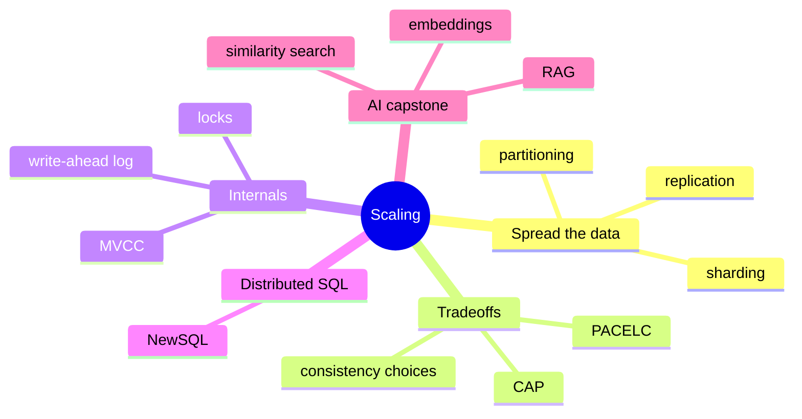

# Stage 6 - Scaling and Advanced

The final stage is about what happens when one machine is no longer enough, and when many users hit the data at once. This is the intermediate-to-advanced gate: not new syntax, but the engineering judgment to reason about distributed-data trade-offs. We take the topics in the order you should actually apply them - scale only when you need to, and in the cheapest way first.

:::info Learning objectives
By the end of this stage you will be able to:

- **Apply replication, partitioning, and sharding** in the right order - replicate first, partition next, shard last.
- **Pick a shard key** and recognize the **hotspots** a bad one creates.
- **Reason about CAP and PACELC**: choose C or A during a partition, and latency vs consistency the rest of the time.
- **Explain the internals** that keep a database correct - MVCC, locks, the write-ahead log - and how **consensus** powers NewSQL.
- **Design a small RAG pipeline**: embeddings, chunking, ANN indexes (HNSW/IVF), hybrid search, and when to re-embed.
- **Match a workload to the right scaling tool** rather than reaching for the most complex option by default.
:::

## Map of this stage

## The lessons in this stage

1. **[Scaling out](./scaling-out.mdx)** - replication, partitioning, and sharding, applied in the right order (shard last), with topology diagrams.
2. **[Consistency and concurrency](./consistency.mdx)** - the CAP and PACELC trade-offs, MVCC and the write-ahead log, and how NewSQL keeps SQL and ACID at scale.
3. **[Vector databases and RAG](./vector-databases.mdx)** - embeddings, nearest-neighbor search, and retrieval-augmented generation: the AI capstone.
4. **[Stage 6 review](./assessment.mdx)** - scaling and consistency scenarios, a RAG-design challenge, a cumulative quiz, and a cheatsheet.

:::note Status
All four Stage 6 lessons are ready - and with them, the whole path (Stages 0-6) is complete.
:::
