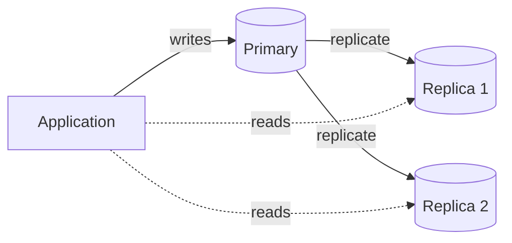
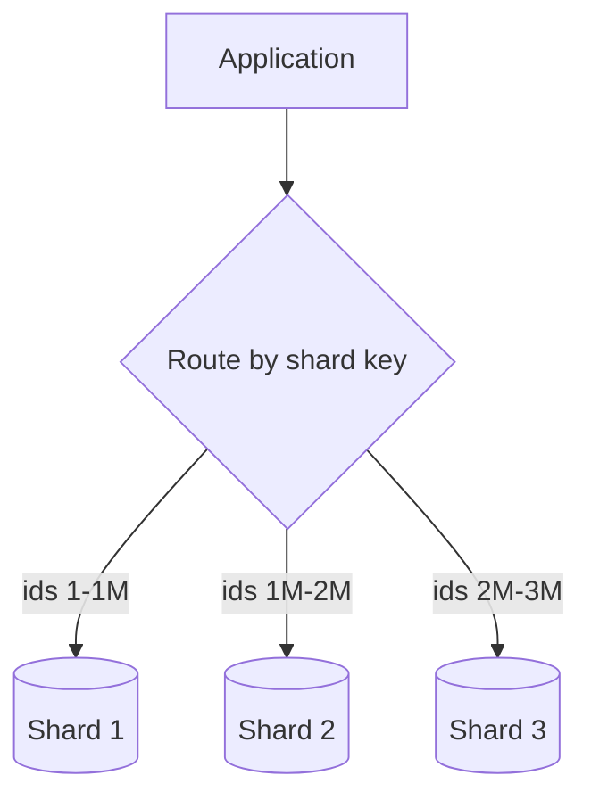

import Quiz from '@site/src/components/Quiz';

# Scaling out: replication, partitioning, sharding

When one machine is no longer enough, you spread the data across several. There are three techniques, and the order you reach for them matters: **replicate first, partition next, shard last.** Each adds capability and complexity.

## Replication: copy the data

**Replication** keeps copies of the database on more than one machine. One node (the **primary**) takes all writes; **replicas** receive a stream of those changes and serve reads. This buys two things: **read scaling** (spread reads across replicas) and **high availability** (if the primary dies, a replica is promoted).

The catch is **replication lag**: with asynchronous replication, a replica may be a moment behind the primary, so a read just after a write can return stale data. Synchronous replication removes that gap but makes writes wait for replicas to confirm.

## Partitioning: split a big table

**Partitioning** breaks one large table into smaller pieces - by range (dates), hash, or list - **within a single database**. Queries that target one partition scan less data, and indexes stay smaller. It is a management and performance win for huge tables, but the data still lives on one server.

## Sharding: split across many databases

**Sharding** splits the data across **many independent databases**, each holding a slice keyed by a **shard key** (customer id, region). This is the only one of the three that scales **writes** horizontally - each shard takes its own.

The cost is steep: queries that span shards are hard, joins across shards may be impossible, a badly chosen key creates **hotspots** (one shard overloaded), and rebalancing as you add shards is painful. That is why you **shard last** - after replication and partitioning have been exhausted.

## The right order

- **Replicate** for read scaling and failover - cheap, do it early.
- **Partition** when a single table grows unwieldy.
- **Shard** only when write volume genuinely exceeds what one primary can take - it adds the most complexity for the most scale.

## Quick quiz

<Quiz
  title="Scaling out"
  questions={[
    {
      prompt: "Which technique scales WRITES across machines?",
      options: [
        {text: "Sharding", correct: true},
        {text: "Replication", correct: false},
        {text: "Partitioning within one database", correct: false},
        {text: "Adding an index", correct: false},
      ],
      explanation: "Sharding splits data across independent databases, each taking its own writes. Replication scales reads; partitioning stays on one server.",
    },
    {
      prompt: "What does replication primarily buy you?",
      options: [
        {text: "Read scaling and high availability (failover)", correct: true},
        {text: "Horizontal write scaling", correct: false},
        {text: "Smaller indexes", correct: false},
        {text: "Stronger consistency guarantees", correct: false},
      ],
      explanation: "Replicas serve reads and stand in if the primary fails. Writes still funnel through the single primary.",
    },
    {
      prompt: "What is replication lag?",
      options: [
        {text: "A replica being briefly behind the primary, so a read can return stale data", correct: true},
        {text: "The time to create an index", correct: false},
        {text: "A deadlock between transactions", correct: false},
        {text: "The cost of a cross-shard join", correct: false},
      ],
      explanation: "With async replication, replicas trail the primary slightly; a read right after a write may see the old value.",
    },
    {
      prompt: "Why is sharding the last resort?",
      options: [
        {text: "Cross-shard queries/joins are hard, keys can create hotspots, and rebalancing is painful", correct: true},
        {text: "It cannot scale writes", correct: false},
        {text: "It makes reads slower than a single server always", correct: false},
        {text: "It is illegal in SQL databases", correct: false},
      ],
      explanation: "Sharding adds the most operational complexity. Exhaust replication and partitioning first; shard only when writes truly exceed one node.",
    },
  ]}
/>

:::tip Next up
Spreading data across machines forces trade-offs. **[Consistency and concurrency](./consistency.mdx)** covers CAP, how databases stay correct under concurrency, and how NewSQL keeps SQL and ACID at scale.
:::
