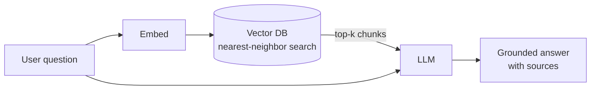

import Quiz from '@site/src/components/Quiz';

# Vector databases and RAG

This is the newest piece of the field, and a fitting capstone: the database technology behind semantic search and AI assistants. Stage 0 introduced it; here is how it actually works.

## Embeddings: meaning as numbers

An **embedding** is a list of numbers (a vector) produced by a model that captures the *meaning* of a piece of text, an image, or audio. The key property: things with **similar meaning** land **close together** in this vector space. "comfortable shoes for long walks" and "cushioned trainers for marathon training" end up near each other, despite sharing no keywords.

### Where embeddings come from

You do not compute embeddings yourself - an **embedding model** does. Two ways to run one:

- **Hosted API** (OpenAI, Cohere, Voyage, Google) - send text, get a vector back. Zero infrastructure, pay per token, but every embed is a network round trip and an ongoing cost.
- **Open-source, self-hosted** (sentence-transformers, BGE, E5, Nomic) - run the model yourself. No per-call fee and data never leaves your environment, at the cost of running the hardware.

Two practical knobs:

- **Dimensionality** - the vector length (e.g. 384, 768, 1536). More dimensions can capture more nuance but cost more storage, memory, and search time. Pick the smallest that retrieves well.
- **Cost and latency** - embedding millions of chunks adds up, and each query embeds the question before searching, so model speed sits on the critical path of every search.

:::warning The query and the documents must use the same model
Embeddings from different models live in incompatible spaces - their distances are meaningless across models. Embed your documents and your queries with the **same model**, or search returns nonsense.
:::

## Similarity search

A vector database stores embeddings and answers "**which stored items are nearest to this query vector?**" - **nearest-neighbor** search, measured by cosine similarity or dot product. Checking every vector exactly is too slow at scale, so vector databases use **approximate nearest-neighbor (ANN)** indexes - **HNSW** (a navigable graph) or **IVF** (clustering) - trading a sliver of accuracy for a massive speed-up. This is the vector equivalent of the B-tree index from Stage 3.

## RAG: grounding an AI in your data

A large language model only knows its training data and can confidently make things up. **Retrieval-augmented generation (RAG)** fixes that: embed the user's question, vector-search your documents for the most relevant chunks, and feed those chunks to the model alongside the question. The model answers from *your* data, with sources.

### Chunking: how you split the documents

You do not embed whole documents - you split them into **chunks** and embed each one. Chunking quality largely *determines* RAG quality, because the chunk is the unit you retrieve and hand to the model.

- **Chunk size** - too large and one vector blurs many topics, so search is imprecise and you waste the model's context on irrelevant text. Too small and a chunk loses the surrounding context needed to make sense. A few hundred tokens is a common starting point.
- **Overlap** - let consecutive chunks share some text (e.g. 10-20%) so a sentence split across a boundary is not orphaned, and an idea spanning the cut survives in at least one chunk.
- **Split on structure** - prefer boundaries that respect meaning (paragraphs, headings, sections) over a blind character count, so each chunk is a coherent unit.

Get chunking wrong and even a perfect embedding model retrieves the wrong passages - it is the most undervalued knob in RAG.

The same retrieval pattern gives AI **agents** long-term memory - store past interactions as vectors, recall the relevant ones later.

## Hybrid search: keywords and vectors together

Vector search is great at *meaning* but can miss exact terms - a product code, an error string, a rare name - where the classic keyword match (**BM25**, full-text search) is unbeatable. **Hybrid search** runs both and combines them: vector search for semantic recall, keyword search for precise matches, merged into one ranked list.

A common refinement adds a **reranking** step: retrieve a broad candidate set cheaply from both methods, then pass those candidates through a slower, more accurate **reranker** model that scores each against the query and reorders the top results. Cheap-and-wide first, expensive-and-precise second - the same two-stage instinct as an ANN index feeding an exact check.

:::warning Embedding drift: re-embed when the model changes
Your stored vectors are only comparable to query vectors from the **same model** (and same version). The day you upgrade the embedding model - for better quality, or because a hosted one is deprecated - your old vectors live in the *old* space and the new query vectors in the *new* one, so distances are meaningless. The fix is to **re-embed the entire corpus** with the new model. Budget for it: a model swap is a full re-index, not a config change, and on a large corpus that is real time and cost.
:::

## Where vectors live (2026)

Two ways to get vector search, and the choice has settled:

- **A vector feature in a database you already run** - PostgreSQL's **`pgvector`**, MongoDB Atlas Vector Search, Oracle, Elasticsearch. The embeddings sit next to your relational data and can be queried in the same transaction.
- **A dedicated vector database** - Pinecone, Weaviate, Qdrant, Milvus, Chroma - built only for this, strongest at very large scale.

The 2026 consensus, exactly as Stage 0 previewed: vectors have shifted from a separate category toward a **data type** any database can hold. For most teams, **`pgvector` on the PostgreSQL they already run is the default**; reach for a dedicated vector database when scale or specialized performance genuinely demands it.

## You have finished the path

From "what is data" to distributed, AI-era databases, you now have the whole arc: read and write SQL, design and normalize a schema, make it correct and fast, ship it safely in a real app, choose and model non-relational stores, and reason about scale. The enduring skill is not memorizing which database is "best" - it is matching the **data shape** and the **workload** to the engine that fits.

## Quick quiz

<Quiz
  title="Vector databases and RAG"
  questions={[
    {
      prompt: "What does a vector database search for?",
      options: [
        {text: "The items whose embeddings are nearest to the query vector (similar in meaning)", correct: true},
        {text: "Exact keyword matches", correct: false},
        {text: "Rows matching a WHERE clause exactly", correct: false},
        {text: "The most recently inserted rows", correct: false},
      ],
      explanation: "It finds nearest neighbors in vector space - items close in meaning - not exact text matches.",
    },
    {
      prompt: "Why do vector databases use approximate nearest-neighbor (ANN) indexes like HNSW?",
      options: [
        {text: "Exact search over millions of vectors is too slow; ANN trades a little accuracy for big speed", correct: true},
        {text: "To guarantee perfectly exact results", correct: false},
        {text: "To enforce foreign keys", correct: false},
        {text: "To compress the database to zero size", correct: false},
      ],
      explanation: "ANN indexes (HNSW, IVF) are to vectors what B-trees are to values - they make search fast at scale, accepting slight approximation.",
    },
    {
      prompt: "Why does chunk size and overlap matter so much for RAG quality?",
      options: [
        {text: "The chunk is the unit you retrieve and feed the model; too large blurs topics, too small loses context", correct: true},
        {text: "It changes how the database shards across nodes", correct: false},
        {text: "It only affects disk usage, not results", correct: false},
        {text: "Smaller chunks are always better", correct: false},
      ],
      explanation: "You retrieve chunks, not documents. Oversized chunks blur many topics; tiny ones lose context. Overlap keeps ideas spanning a boundary intact.",
    },
    {
      prompt: "What is hybrid search?",
      options: [
        {text: "Combining keyword (BM25) and vector search, often with a reranking step", correct: true},
        {text: "Using two different databases for the same query", correct: false},
        {text: "Embedding text with two models and averaging", correct: false},
        {text: "Sharding vectors across nodes", correct: false},
      ],
      explanation: "Hybrid search merges semantic vector recall with precise keyword matching, frequently adding a reranker to reorder the top candidates.",
    },
    {
      prompt: "Why must you re-embed your whole corpus when you change embedding models?",
      options: [
        {text: "Vectors from different models live in incompatible spaces, so old and new vectors are not comparable", correct: true},
        {text: "The database deletes old vectors automatically", correct: false},
        {text: "New models always have fewer dimensions", correct: false},
        {text: "Re-embedding is free and instant", correct: false},
      ],
      explanation: "Distances are only meaningful within one model's space. A model swap is a full re-index - budget the time and cost on a large corpus.",
    },
    {
      prompt: "What problem does RAG solve?",
      options: [
        {text: "It grounds an LLM in your own documents, reducing made-up answers", correct: true},
        {text: "It makes the database write faster", correct: false},
        {text: "It shards data across nodes", correct: false},
        {text: "It replaces the need for embeddings", correct: false},
      ],
      explanation: "RAG retrieves relevant chunks via vector search and feeds them to the model, so it answers from your data with sources instead of guessing.",
    },
    {
      prompt: "What is the 2026 default way to add vector search for most teams?",
      options: [
        {text: "An extension like pgvector on the database they already run", correct: true},
        {text: "Always a dedicated vector database", correct: false},
        {text: "Rewriting the app in a new language", correct: false},
        {text: "Storing vectors in a spreadsheet", correct: false},
      ],
      explanation: "Vectors are now a data type a normal database can hold; pgvector keeps embeddings beside relational data. Dedicated vector DBs are for when scale demands it.",
    },
  ]}
/>

:::tip One thing left - put it all together
Finish with the **[Capstone project](../capstone)**: build a bookstore database from scratch and apply every stage - design, query, index, and secure.
:::
